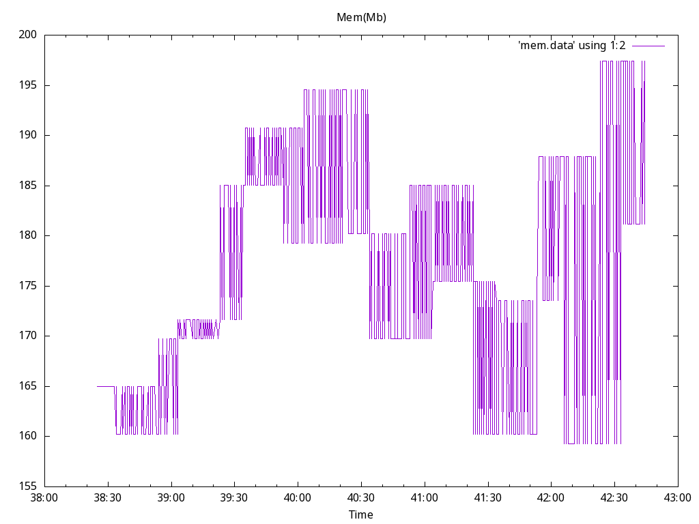
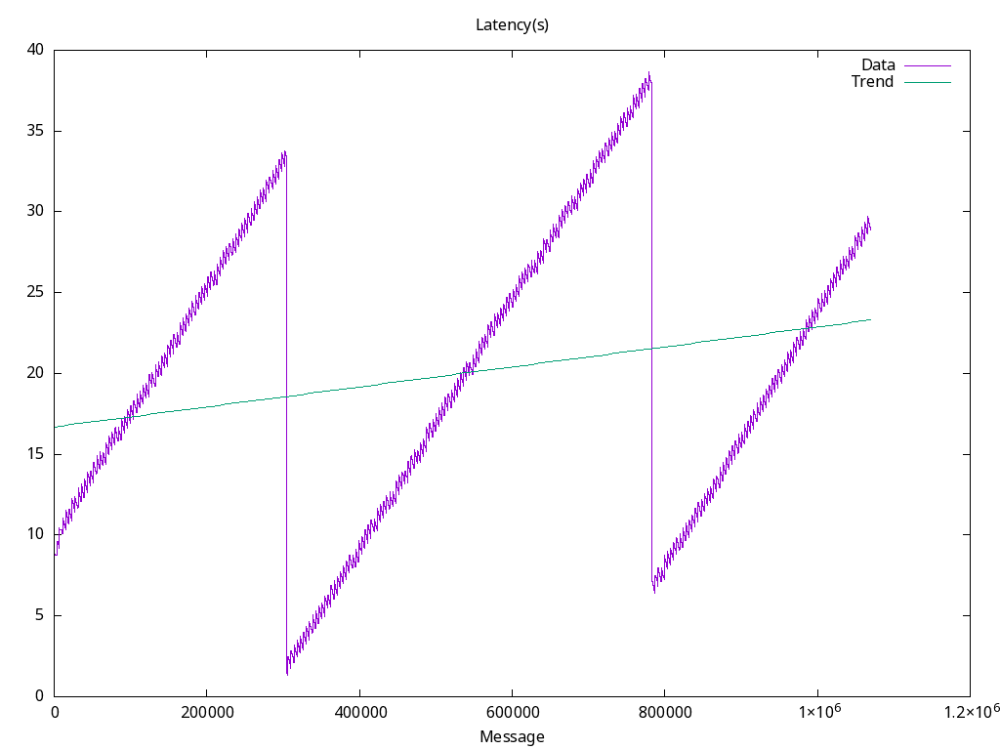
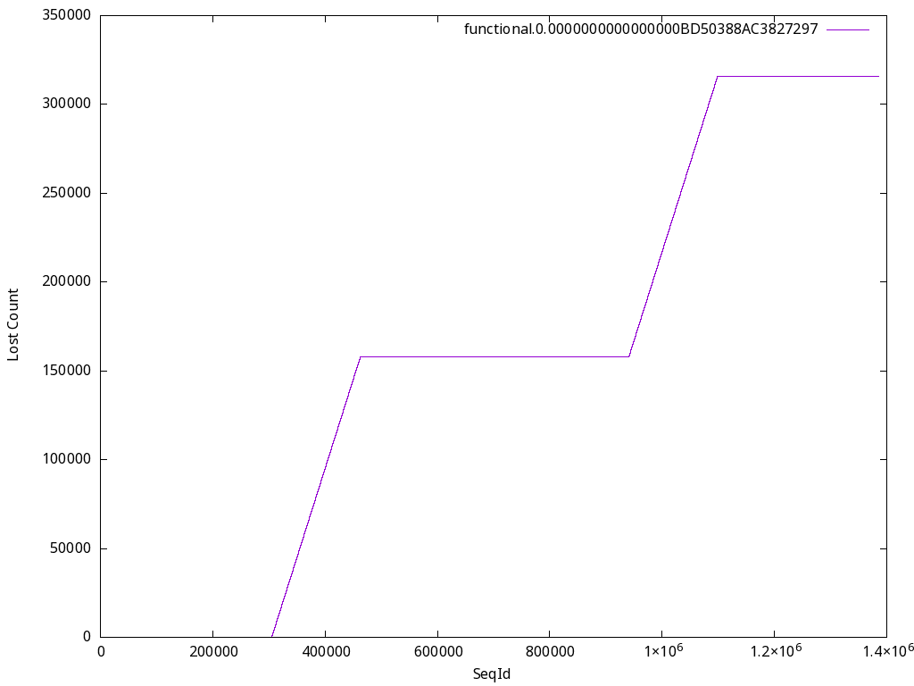

# collector Functionl Benchmark Results
## Options
* Image: quay.io/openshift-logging/fluentd:5.7
* Total Log Stressors: 1
* Lines Per Second: 5000
* Run Duration: 05m
* Payload Source: synthetic

## Latency of logs collected based on the time the log was generated and ingested

Total Msg| Size | Elapsed (s) | Mean (s)| Min(s) | Max (s)| Median (s)
---------|------|-------------|---------|--------|--------|---
1069708|256|5m0s|20.003|1.357|38.673|19.953








## Percent logs lost between first and last collected sequence ids
Stream |  Min Seq | Max Seq | Purged | Collected | Percent Collected |
-------| ---------| --------| -------|-----------|--------------|
| functional.0.0000000000000000BD50388AC3827297|0|1385707|0|1069708|77.2%


## Config

```
## CLO GENERATED CONFIGURATION ###
# This file is a copy of the fluentd configuration entrypoint
# which should normally be supplied in a configmap.

<system>
  log_level "#{ENV['LOG_LEVEL'] || 'warn'}"
</system>

# Prometheus Monitoring
<source>
  @type prometheus
  bind "#{ENV['PROM_BIND_IP']}"
  <transport tls>
    cert_path /etc/collector/metrics/tls.crt
    private_key_path /etc/collector/metrics/tls.key
    min_version TLS1_2
    max_version TLS1_3
    ciphers TLS_AES_128_GCM_SHA256:TLS_AES_256_GCM_SHA384:TLS_CHACHA20_POLY1305_SHA256:ECDHE-ECDSA-AES128-GCM-SHA256:ECDHE-RSA-AES128-GCM-SHA256:ECDHE-ECDSA-AES256-GCM-SHA384:ECDHE-RSA-AES256-GCM-SHA384:ECDHE-ECDSA-CHACHA20-POLY1305:ECDHE-RSA-CHACHA20-POLY1305:DHE-RSA-AES128-GCM-SHA256:DHE-RSA-AES256-GCM-SHA384
  </transport>
</source>

<source>
  @type prometheus_monitor
  <labels>
    hostname ${hostname}
  </labels>
</source>

# excluding prometheus_tail_monitor
# since it leaks namespace/pod info
# via file paths

# tail_monitor plugin which publishes log_collected_bytes_total
<source>
  @type collected_tail_monitor
  <labels>
    hostname ${hostname}
  </labels>
</source>

# This is considered experimental by the repo
<source>
  @type prometheus_output_monitor
  <labels>
    hostname ${hostname}
  </labels>
</source>

# Logs from containers (including openshift containers)
<source>
  @type tail
  @id container-input
  path "/var/log/pods/testhack-etvi4xn5_*/loader-*/*.log"
  exclude_path ["/var/log/pods/testhack-etvi4xn5_collector-*/*/*.log", "/var/log/pods/testhack-etvi4xn5_elasticsearch-*/*/*.log", "/var/log/pods/testhack-etvi4xn5_kibana-*/*/*.log", "/var/log/pods/testhack-etvi4xn5_*/loki*/*.log", "/var/log/pods/testhack-etvi4xn5_*/gateway/*.log", "/var/log/pods/testhack-etvi4xn5_*/opa/*.log", "/var/log/pods/*/*/*.gz", "/var/log/pods/*/*/*.tmp"]
  pos_file "/var/lib/fluentd/pos/es-containers.log.pos"
  follow_inodes true
  refresh_interval 5
  rotate_wait 5
  tag kubernetes.*
  read_from_head "true"
  skip_refresh_on_startup true
  @label @CONCAT
  <parse>
    @type regexp
    expression /^(?<@timestamp>[^\s]+) (?<stream>stdout|stderr) (?<logtag>[F|P]) (?<message>.*)$/
    time_key '@timestamp'
    keep_time_key true
  </parse>
</source>

# Concat log lines of container logs, and send to INGRESS pipeline
<label @CONCAT>
  <filter kubernetes.**>
    @type concat
    key message
    partial_key logtag
    partial_value P
    separator ''
  </filter>

  <match kubernetes.**>
    @type relabel
    @label @INGRESS
  </match>
</label>

# Ingress pipeline
<label @INGRESS>
  # Filter out PRIORITY from journal logs
  <filter journal>
    @type grep
    <exclude>
      key PRIORITY
      pattern ^7$
    </exclude>
  </filter>

  # Process OVN logs
  <filter ovn-audit.log**>
    @type record_modifier
    <record>
      @timestamp ${DateTime.parse(record['message'].split('|')[0]).rfc3339(6)}
      level ${record['message'].split('|')[3].downcase}
    </record>
  </filter>

  # Process Kube and OpenShift Audit logs
  <filter k8s-audit.log openshift-audit.log>
    @type record_modifier
    <record>
      @timestamp ${record['requestReceivedTimestamp']}
    </record>
  </filter>

  # Retag Journal logs to specific tags
  <match journal>
    @type rewrite_tag_filter
    # skip to @INGRESS label section
    @label @INGRESS

    # see if this is a kibana container for special log handling
    # looks like this:
    # k8s_kibana.a67f366_logging-kibana-1-d90e3_logging_26c51a61-2835-11e6-ad29-fa163e4944d5_f0db49a2
    # we filter these logs through the kibana_transform.conf filter
    <rule>
      key CONTAINER_NAME
      pattern ^k8s_kibana\.
      tag kubernetes.journal.container.kibana
    </rule>

    <rule>
      key CONTAINER_NAME
      pattern ^k8s_[^_]+_logging-eventrouter-[^_]+_
      tag kubernetes.journal.container._default_.kubernetes-event
    </rule>

    # mark logs from default namespace for processing as k8s logs but stored as system logs
    <rule>
      key CONTAINER_NAME
      pattern ^k8s_[^_]+_[^_]+_default_
      tag kubernetes.journal.container._default_
    </rule>

    # mark logs from kube-* namespaces for processing as k8s logs but stored as system logs
    <rule>
      key CONTAINER_NAME
      pattern ^k8s_[^_]+_[^_]+_kube-(.+)_
      tag kubernetes.journal.container._kube-$1_
    </rule>

    # mark logs from openshift-* namespaces for processing as k8s logs but stored as system logs
    <rule>
      key CONTAINER_NAME
      pattern ^k8s_[^_]+_[^_]+_openshift-(.+)_
      tag kubernetes.journal.container._openshift-$1_
    </rule>

    # mark logs from openshift namespace for processing as k8s logs but stored as system logs
    <rule>
      key CONTAINER_NAME
      pattern ^k8s_[^_]+_[^_]+_openshift_
      tag kubernetes.journal.container._openshift_
    </rule>

    # mark fluentd container logs
    <rule>
      key CONTAINER_NAME
      pattern ^k8s_.*fluentd
      tag kubernetes.journal.container.fluentd
    </rule>

    # this is a kubernetes container
    <rule>
      key CONTAINER_NAME
      pattern ^k8s_
      tag kubernetes.journal.container
    </rule>

    # not kubernetes - assume a system log or system container log
    <rule>
      key _TRANSPORT
      pattern .+
      tag journal.system
    </rule>
  </match>

  # Invoke kubernetes apiserver to get kubernetes metadata
  <filter kubernetes.**>
    @id kubernetes-metadata
    @type kubernetes_metadata
    kubernetes_url 'https://kubernetes.default.svc'
    annotation_match ["^containerType\.logging\.openshift\.io\/.*$"]
    allow_orphans false
    cache_size '1000'
    ssl_partial_chain 'true'
  </filter>

  # Parse Json fields for container, journal and eventrouter logs
  <filter kubernetes.var.log.pods.**_eventrouter-**>
    @type parse_json_field
    merge_json_log true
    preserve_json_log true
    json_fields 'message'
  </filter>

  # Fix level field in audit logs
  <filter k8s-audit.log**>
    @type record_modifier
    <record>
      k8s_audit_level ${record['level']}
    </record>
  </filter>

  <filter openshift-audit.log**>
    @type record_modifier
    <record>
      openshift_audit_level ${record['level']}
    </record>
  </filter>

  # Viaq Data Model
  <filter **>
    @type viaq_data_model
    enable_flatten_labels true
    enable_prune_empty_fields false
    default_keep_fields CEE,time,@timestamp,aushape,ci_job,collectd,docker,fedora-ci,file,foreman,geoip,hostname,ipaddr4,ipaddr6,kubernetes,level,message,namespace_name,namespace_uuid,offset,openstack,ovirt,pid,pipeline_metadata,rsyslog,service,systemd,tags,testcase,tlog,viaq_msg_id
    keep_empty_fields 'message'
    rename_time true
    pipeline_type 'collector'
    process_kubernetes_events false
    <level>
      name warn
      match 'Warning|WARN|^W[0-9]+|level=warn|Value:warn|"level":"warn"'
    </level>
    <level>
      name info
      match 'Info|INFO|^I[0-9]+|level=info|Value:info|"level":"info"'
    </level>
    <level>
      name error
      match 'Error|ERROR|^E[0-9]+|level=error|Value:error|"level":"error"'
    </level>
    <level>
      name critical
      match 'Critical|CRITICAL|^C[0-9]+|level=critical|Value:critical|"level":"critical"'
    </level>
    <level>
      name debug
      match 'Debug|DEBUG|^D[0-9]+|level=debug|Value:debug|"level":"debug"'
    </level>
    <formatter>
      tag "journal.system**"
      type sys_journal
      remove_keys log,stream,MESSAGE,_SOURCE_REALTIME_TIMESTAMP,__REALTIME_TIMESTAMP,CONTAINER_ID,CONTAINER_ID_FULL,CONTAINER_NAME,PRIORITY,_BOOT_ID,_CAP_EFFECTIVE,_CMDLINE,_COMM,_EXE,_GID,_HOSTNAME,_MACHINE_ID,_PID,_SELINUX_CONTEXT,_SYSTEMD_CGROUP,_SYSTEMD_SLICE,_SYSTEMD_UNIT,_TRANSPORT,_UID,_AUDIT_LOGINUID,_AUDIT_SESSION,_SYSTEMD_OWNER_UID,_SYSTEMD_SESSION,_SYSTEMD_USER_UNIT,CODE_FILE,CODE_FUNCTION,CODE_LINE,ERRNO,MESSAGE_ID,RESULT,UNIT,_KERNEL_DEVICE,_KERNEL_SUBSYSTEM,_UDEV_SYSNAME,_UDEV_DEVNODE,_UDEV_DEVLINK,SYSLOG_FACILITY,SYSLOG_IDENTIFIER,SYSLOG_PID
    </formatter>
    <formatter>
      tag "kubernetes.var.log.pods.**_eventrouter-** k8s-audit.log** openshift-audit.log** ovn-audit.log**"
      type k8s_json_file
      remove_keys stream
      process_kubernetes_events 'true'
    </formatter>
    <formatter>
      tag "kubernetes.var.log.pods**"
      type k8s_json_file
      remove_keys stream
    </formatter>
  </filter>

  # Generate elasticsearch id
  <filter **>
    @type elasticsearch_genid_ext
    hash_id_key viaq_msg_id
    alt_key kubernetes.event.metadata.uid
    alt_tags 'kubernetes.var.log.pods.**_eventrouter-*.** kubernetes.journal.container._default_.kubernetes-event'
  </filter>

  # Discard Infrastructure logs
  <match kubernetes.var.log.pods.openshift_** kubernetes.var.log.pods.openshift-*_** kubernetes.var.log.pods.default_** kubernetes.var.log.pods.kube-*_** journal.** system.var.log**>
    @type null
  </match>

  # Include Application logs
  <match kubernetes.**>
    @type relabel
    @label @_APPLICATION
  </match>

  # Discard Audit logs
  <match linux-audit.log** k8s-audit.log** openshift-audit.log** ovn-audit.log**>
    @type null
  </match>

  # Send any remaining unmatched tags to stdout
  <match **>
    @type stdout
  </match>
</label>

# Routing Application to pipelines
<label @_APPLICATION>
  <filter **>
    @type record_modifier
    <record>
      log_type application
    </record>
  </filter>

  <match **>
    @type label_router
    <route>
      @label @FORWARD_PIPELINE
      <match>
        namespaces testhack-etvi4xn5
      </match>
    </route>
  </match>
</label>

# Copying pipeline forward-pipeline to outputs
<label @FORWARD_PIPELINE>
  <match **>
    @type relabel
    @label @HTTP
  </match>
</label>

# Ship logs to specific outputs
<label @HTTP>
  #dedot namespace_labels and rebuild message field if present
  <filter **>
    @type record_modifier
    <record>
      _dummy_ ${if m=record.dig("kubernetes","namespace_labels");record["kubernetes"]["namespace_labels"]={}.tap{|n|m.each{|k,v|n[k.gsub(/[.\/]/,'_')]=v}};end}
      _dummy2_ ${if m=record.dig("kubernetes","labels");record["kubernetes"]["labels"]={}.tap{|n|m.each{|k,v|n[k.gsub(/[.\/]/,'_')]=v}};end}
      _dummy3_ ${if m=record.dig("kubernetes","flat_labels");record["kubernetes"]["flat_labels"]=[].tap{|n|m.each_with_index{|s, i|n[i] = s.gsub(/[.\/]/,'_')}};end}
    </record>
    remove_keys _dummy_, _dummy2_, _dummy3_
  </filter>

  <match **>
    @type http
    endpoint http://localhost:8090
    http_method post
    content_type application/x-ndjson
    headers {"k1":"v1"}

    <buffer>
      @type file
      path '/var/lib/fluentd/http'
      flush_mode interval
      flush_interval 1s
      flush_thread_count 2
      retry_type exponential_backoff
      retry_wait 1s
      retry_max_interval 60s
      retry_timeout 60m
      queued_chunks_limit_size "#{ENV['BUFFER_QUEUE_LIMIT'] || '32'}"
      total_limit_size "#{ENV['TOTAL_LIMIT_SIZE_PER_BUFFER'] || '8589934592'}"
      chunk_limit_size "#{ENV['BUFFER_SIZE_LIMIT'] || '8m'}"
      overflow_action block
      disable_chunk_backup true
    </buffer>
  </match>
</label>
```

