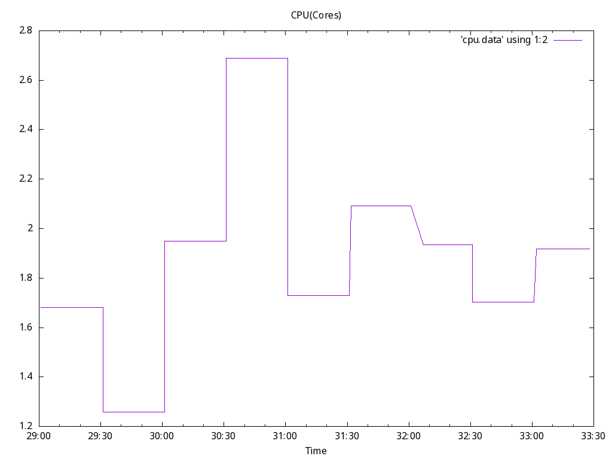
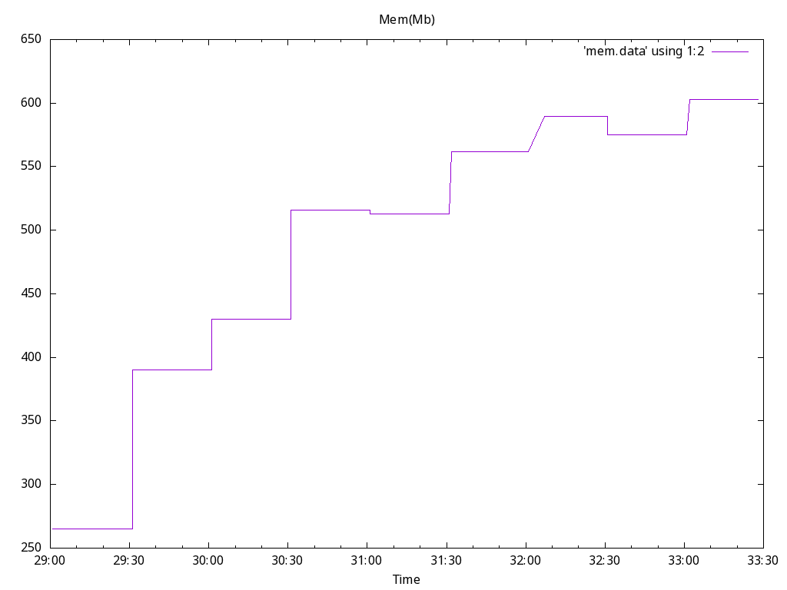
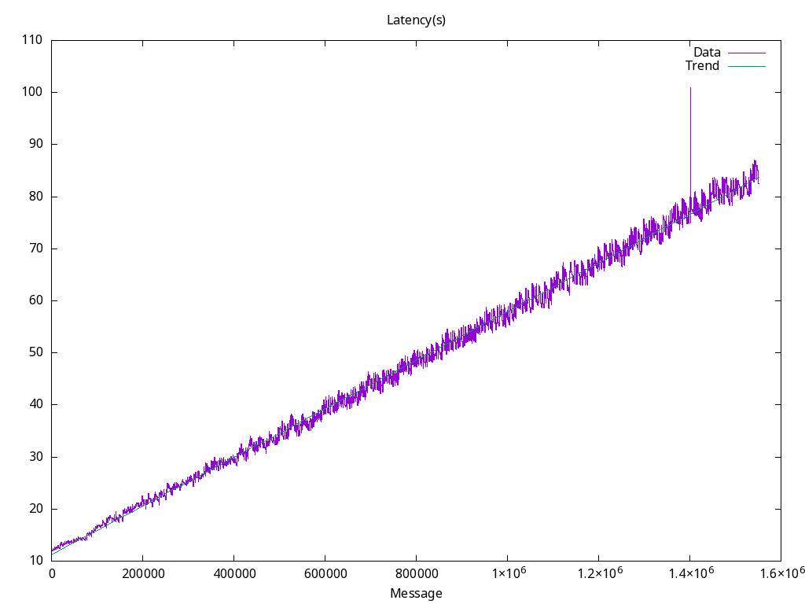
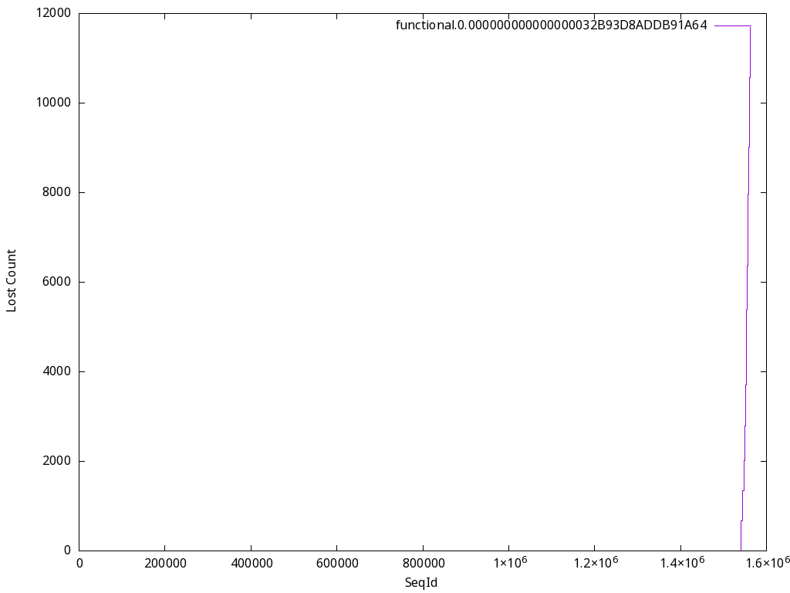

# collector Functionl Benchmark Results
## Options
* Image: quay.io/openshift-logging/vector:5.7
* Total Log Stressors: 1
* Lines Per Second: 7000
* Run Duration: 05m
* Payload Source: synthetic

## Latency of logs collected based on the time the log was generated and ingested

Total Msg| Size | Elapsed (s) | Mean (s)| Min(s) | Max (s)| Median (s)
---------|------|-------------|---------|--------|--------|---
1550877|1024|5m0s|47.449|11.986|101.010|47.055









## Percent logs lost between first and last collected sequence ids
Stream |  Min Seq | Max Seq | Purged | Collected | Percent Collected |
-------| ---------| --------| -------|-----------|--------------|
| functional.0.000000000000000032B93D8ADDB91A64|0|1562559|0|1550877|99.3%


## Config

```
# Logs from containers (including openshift containers)
[sources.raw_container_logs]
type = "kubernetes_logs"
glob_minimum_cooldown_ms = 15000
auto_partial_merge = true
exclude_paths_glob_patterns = ["/var/log/pods/testhack-o4lyqrg6_collector-*/*/*.log", "/var/log/pods/testhack-o4lyqrg6_elasticsearch-*/*/*.log", "/var/log/pods/testhack-o4lyqrg6_*/loki*/*.log", "/var/log/pods/testhack-o4lyqrg6_kibana-*/*/*.log", "/var/log/pods/testhack-o4lyqrg6_*/gateway/*.log", "/var/log/pods/testhack-o4lyqrg6_*/opa/*.log", "/var/log/pods/*/*/*.gz", "/var/log/pods/*/*/*.tmp"]
pod_annotation_fields.pod_labels = "kubernetes.labels"
pod_annotation_fields.pod_namespace = "kubernetes.namespace_name"
pod_annotation_fields.pod_annotations = "kubernetes.annotations"
pod_annotation_fields.pod_uid = "kubernetes.pod_id"
pod_annotation_fields.pod_node_name = "hostname"
namespace_annotation_fields.namespace_uid = "kubernetes.namespace_id"

[sources.internal_metrics]
type = "internal_metrics"

[transforms.container_logs]
type = "remap"
inputs = ["raw_container_logs"]
source = '''
  .openshift.cluster_id = "${OPENSHIFT_CLUSTER_ID:-}"
  if !exists(.level) {
    .level = "default"
    if match!(.message, r'Info|INFO|^I[0-9]+|level=info|Value:info|"level":"info"|<info>') {
      .level = "info"
    } else if match!(.message, r'Warning|WARN|^W[0-9]+|level=warn|Value:warn|"level":"warn"|<warn>') {
      .level = "warn"
    } else if match!(.message, r'Error|ERROR|^E[0-9]+|level=error|Value:error|"level":"error"|<error>') {
      .level = "error"
    } else if match!(.message, r'Critical|CRITICAL|^C[0-9]+|level=critical|Value:critical|"level":"critical"|<critical>') {
      .level = "critical"
    } else if match!(.message, r'Debug|DEBUG|^D[0-9]+|level=debug|Value:debug|"level":"debug"|<debug>') {
      .level = "debug"
    } else if match!(.message, r'Notice|NOTICE|^N[0-9]+|level=notice|Value:notice|"level":"notice"|<notice>') {
      .level = "notice"
    } else if match!(.message, r'Alert|ALERT|^A[0-9]+|level=alert|Value:alert|"level":"alert"|<alert>') {
      .level = "alert"
    } else if match!(.message, r'Emergency|EMERGENCY|^EM[0-9]+|level=emergency|Value:emergency|"level":"emergency"|<emergency>') {
      .level = "emergency"
    }
  }
  del(.source_type)
  del(.stream)
  del(.kubernetes.pod_ips)
  del(.kubernetes.node_labels)
  del(.timestamp_end)
  ts = del(.timestamp); if !exists(."@timestamp") {."@timestamp" = ts}
'''

[transforms.route_container_logs]
type = "route"
inputs = ["container_logs"]
route.app = '!((starts_with!(.kubernetes.namespace_name,"kube-")) || (starts_with!(.kubernetes.namespace_name,"openshift-")) || (.kubernetes.namespace_name == "default") || (.kubernetes.namespace_name == "openshift") || (.kubernetes.namespace_name == "kube"))'

# Set log_type to "application"
[transforms.application]
type = "remap"
inputs = ["route_container_logs.app"]
source = '''
  .log_type = "application"
'''

[transforms.route_application_logs]
type = "route"
inputs = ["application"]
route.benchmark = '.kubernetes.namespace_name == "testhack-o4lyqrg6"'

[transforms.forward_pipeline_user_defined]
type = "remap"
inputs = ["route_application_logs.benchmark"]
source = '''
  .
'''

[transforms.http_normalize_http]
type = "remap"
inputs = ["forward_pipeline_user_defined"]
source = '''
  del(.file)
'''

[transforms.http_dedot]
type = "lua"
inputs = ["http_normalize_http"]
version = "2"
hooks.init = "init"
hooks.process = "process"
source = '''
    function init()
        count = 0
    end
    function process(event, emit)
        count = count + 1
        event.log.openshift.sequence = count
        if event.log.kubernetes == nil then
            emit(event)
            return
        end
        if event.log.kubernetes.labels == nil then
            emit(event)
            return
        end
		dedot(event.log.kubernetes.namespace_labels)
        dedot(event.log.kubernetes.labels)
        emit(event)
    end
	
    function dedot(map)
        if map == nil then
            return
        end
        local new_map = {}
        local changed_keys = {}
        for k, v in pairs(map) do
            local dedotted = string.gsub(k, "[./]", "_")
            if dedotted ~= k then
                new_map[dedotted] = v
                changed_keys[k] = true
            end
        end
        for k in pairs(changed_keys) do
            map[k] = nil
        end
        for k, v in pairs(new_map) do
            map[k] = v
        end
    end
'''

[sinks.http]
type = "http"
inputs = ["http_dedot"]
uri = "http://localhost:8090"
method = "post"

[sinks.http.encoding]
codec = "json"

[sinks.http.request]
timeout_secs = 10
headers = {"k1"="v1"}

[transforms.add_nodename_to_metric]
type = "remap"
inputs = ["internal_metrics"]
source = '''
.tags.hostname = get_env_var!("VECTOR_SELF_NODE_NAME")
'''


```

