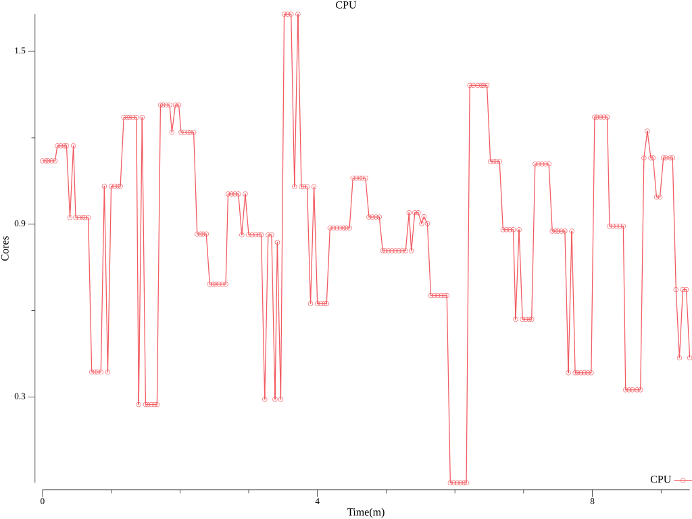
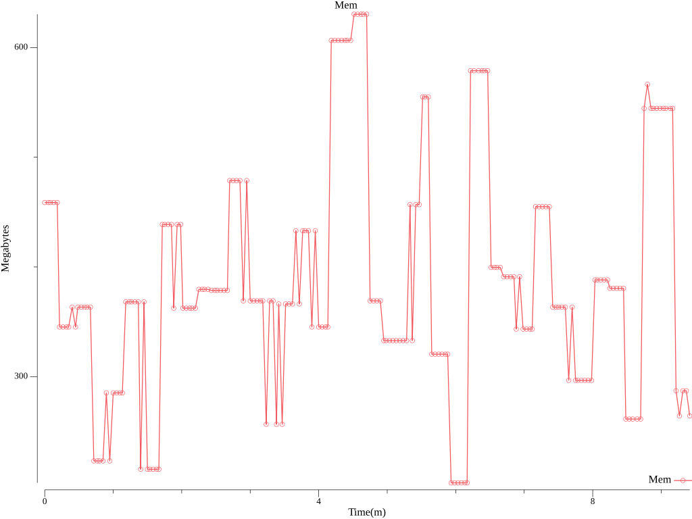
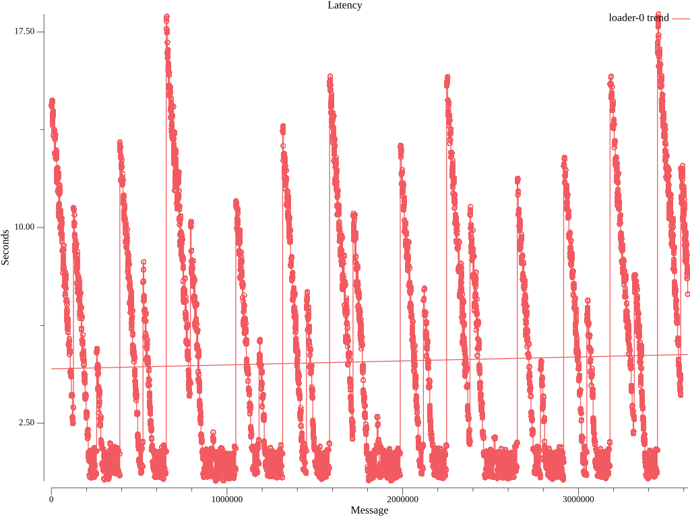
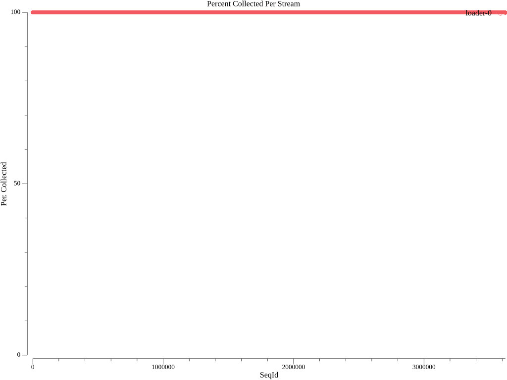

# collector Functionl Benchmark Results
## Options
* Image: quay.io/openshift-logging/vector:v0.37.1
* Total Log Stressors: 1
* Lines Per Second: 6000
* Run Duration: 10m
* Payload Source: synthetic

## Latency of logs collected based on the time the log was generated and ingested

Total Msg| Size | Elapsed (s) | Mean (s)| Min(s) | Max (s)| Median (s)
---------|------|-------------|---------|--------|--------|---
3622399|512|10m0s|4.858|0.285|18.178|3.513









## Percent logs lost between first and last collected sequence ids
Stream |  Min Seq | Max Seq | Purged | Collected | Percent Collected |
-------| ---------| --------| -------|-----------|--------------|
| loader-0|0|3624304|0|3622399|99.9%


## Config

```
expire_metrics_secs = 60
data_dir = "/var/lib/vector/testhack-btqfbakd/functional"

[api]
enabled = true

# Load sensitive data from files
[secret.kubernetes_secret]
type = "file"
base_path = "/var/run/ocp-collector/secrets"

[sources.internal_metrics]
type = "internal_metrics"

# Logs from containers (including openshift containers)
[sources.input_benchmark_container]
type = "kubernetes_logs"
max_read_bytes = 3145728
glob_minimum_cooldown_ms = 15000
auto_partial_merge = true
include_paths_glob_patterns = ["/var/log/pods/testhack-btqfbakd_*/*/*.log"]
exclude_paths_glob_patterns = ["/var/log/pods/*/*/*.gz", "/var/log/pods/*/*/*.log.*", "/var/log/pods/*/*/*.tmp", "/var/log/pods/*/collector/*.log", "/var/log/pods/*/http/*.log", "/var/log/pods/default_*/*/*.log", "/var/log/pods/kube-*_*/*/*.log", "/var/log/pods/kube_*/*/*.log", "/var/log/pods/openshift-*_*/*/*.log", "/var/log/pods/openshift_*/*/*.log"]
pod_annotation_fields.pod_labels = "kubernetes.labels"
pod_annotation_fields.pod_namespace = "kubernetes.namespace_name"
pod_annotation_fields.pod_annotations = "kubernetes.annotations"
pod_annotation_fields.pod_uid = "kubernetes.pod_id"
pod_annotation_fields.pod_node_name = "hostname"
namespace_annotation_fields.namespace_uid = "kubernetes.namespace_id"
rotate_wait_secs = 5

[transforms.input_benchmark_container_meta]
type = "remap"
inputs = ["input_benchmark_container"]
source = '''
  .log_source = "container"
  # If namespace is infra, label log_type as infra
  if match_any(string!(.kubernetes.namespace_name), [r'^default$', r'^openshift(-.+)?$', r'^kube(-.+)?$']) {
      .log_type = "infrastructure"
  } else {
      .log_type = "application"
  }
'''

[transforms.pipeline_forward_pipeline_viaq_0]
type = "remap"
inputs = ["input_benchmark_container_meta"]
source = '''
  if .log_source == "container" {
    .openshift.cluster_id = "${OPENSHIFT_CLUSTER_ID:-}"
  if !exists(.level) {
    .level = "default"
    # Match on well known structured patterns
    # Order: emergency, alert, critical, error, warn, notice, info, debug, trace
    if match!(.message, r'^EM[0-9]+|level=emergency|Value:emergency|"level":"emergency"') {
      .level = "emergency"
    } else if match!(.message, r'^A[0-9]+|level=alert|Value:alert|"level":"alert"') {
      .level = "alert"
    } else if match!(.message, r'^C[0-9]+|level=critical|Value:critical|"level":"critical"') {
      .level = "critical"
    } else if match!(.message, r'^E[0-9]+|level=error|Value:error|"level":"error"') {
      .level = "error"
    } else if match!(.message, r'^W[0-9]+|level=warn|Value:warn|"level":"warn"') {
      .level = "warn"
    } else if match!(.message, r'^N[0-9]+|level=notice|Value:notice|"level":"notice"') {
      .level = "notice"
    } else if match!(.message, r'^I[0-9]+|level=info|Value:info|"level":"info"') {
      .level = "info"
    } else if match!(.message, r'^D[0-9]+|level=debug|Value:debug|"level":"debug"') {
      .level = "debug"
    } else if match!(.message, r'^T[0-9]+|level=trace|Value:trace|"level":"trace"') {
      .level = "trace"
    }
    # Match on unstructured keywords in same order
    if .level == "default" {
      if match!(.message, r'Emergency|EMERGENCY|<emergency>') {
        .level = "emergency"
      } else if match!(.message, r'Alert|ALERT|<alert>') {
        .level = "alert"
      } else if match!(.message, r'Critical|CRITICAL|<critical>') {
        .level = "critical"
      } else if match!(.message, r'Error|ERROR|<error>') {
        .level = "error"
      } else if match!(.message, r'Warning|WARN|<warn>') {
        .level = "warn"
      } else if match!(.message, r'Notice|NOTICE|<notice>') {
        .level = "notice"
      } else if match!(.message, r'(?i)\b(?:info)\b|<info>') {
        .level = "info"
      } else if match!(.message, r'Debug|DEBUG|<debug>') {
        .level = "debug"
      } else if match!(.message, r'Trace|TRACE|<trace>') {
        .level = "trace"
      }
    }
  }
  pod_name = string!(.kubernetes.pod_name)
  if starts_with(pod_name, "eventrouter-") {
    parsed, err = parse_json(.message)
    if err != null {
      log("Unable to process EventRouter log: " + err, level: "info")
    } else {
      ., err = merge(.,parsed)
      if err == null && exists(.event) && is_object(.event) {
          if exists(.verb) {
            .event.verb = .verb
            del(.verb)
          }
          .kubernetes.event = del(.event)
          .message = del(.kubernetes.event.message)
          . = set!(., ["@timestamp"], .kubernetes.event.metadata.creationTimestamp)
          del(.kubernetes.event.metadata.creationTimestamp)
  		. = compact(., nullish: true)
      } else {
        log("Unable to merge EventRouter log message into record: " + err, level: "info")
      }
    }
  }
  del(._partial)
  del(.file)
  del(.source_type)
  .kubernetes.container_iostream = del(.stream)
  del(.kubernetes.pod_ips)
  del(.kubernetes.node_labels)
  del(.timestamp_end)
  if !exists(."@timestamp") {."@timestamp" = .timestamp}
  .openshift.sequence = to_unix_timestamp(now(), unit: "nanoseconds")
  }
'''

[transforms.pipeline_forward_pipeline_viaqdedot_1]
type = "remap"
inputs = ["pipeline_forward_pipeline_viaq_0"]
source = '''
  if .log_source == "container" {
    if exists(.kubernetes.namespace_labels) {
      ._internal.kubernetes.namespace_labels = .kubernetes.namespace_labels
      for_each(object!(.kubernetes.namespace_labels)) -> |key,value| { 
        newkey = replace(key, r'[\./]', "_") 
        .kubernetes.namespace_labels = set!(.kubernetes.namespace_labels,[newkey],value)
        if newkey != key {.kubernetes.namespace_labels = remove!(.kubernetes.namespace_labels,[key],true)}
      }
    }
    if exists(.kubernetes.labels) {
      ._internal.kubernetes.labels = .kubernetes.labels
      for_each(object!(.kubernetes.labels)) -> |key,value| { 
        newkey = replace(key, r'[\./]', "_") 
        .kubernetes.labels = set!(.kubernetes.labels,[newkey],value)
        if newkey != key {.kubernetes.labels = remove!(.kubernetes.labels,[key],true)}
      }
    }
  }
  if exists(.openshift.labels) {for_each(object!(.openshift.labels)) -> |key,value| {
    newkey = replace(key, r'[\./]', "_") 
    .openshift.labels = set!(.openshift.labels,[newkey],value)
    if newkey != key {.openshift.labels = remove!(.openshift.labels,[key],true)}
  }}
'''

[sinks.output_http]
type = "http"
inputs = ["pipeline_forward_pipeline_viaqdedot_1"]
uri = "http://localhost:8090"
method = "post"

[sinks.output_http.encoding]
codec = "json"
except_fields = ["_internal"]

[sinks.output_http.tls]
min_tls_version = "VersionTLS12"
ciphersuites = "TLS_AES_128_GCM_SHA256,TLS_AES_256_GCM_SHA384,TLS_CHACHA20_POLY1305_SHA256,ECDHE-ECDSA-AES128-GCM-SHA256,ECDHE-RSA-AES128-GCM-SHA256,ECDHE-ECDSA-AES256-GCM-SHA384,ECDHE-RSA-AES256-GCM-SHA384,ECDHE-ECDSA-CHACHA20-POLY1305,ECDHE-RSA-CHACHA20-POLY1305,DHE-RSA-AES128-GCM-SHA256,DHE-RSA-AES256-GCM-SHA384"

[transforms.add_nodename_to_metric]
type = "remap"
inputs = ["internal_metrics"]
source = '''
.tags.hostname = get_env_var!("VECTOR_SELF_NODE_NAME")
'''

[sinks.prometheus_output]
type = "prometheus_exporter"
inputs = ["add_nodename_to_metric"]
address = "[::]:24231"
default_namespace = "collector"

[sinks.prometheus_output.tls]
enabled = true
key_file = "/etc/collector/metrics/tls.key"
crt_file = "/etc/collector/metrics/tls.crt"
min_tls_version = "VersionTLS12"
ciphersuites = "TLS_AES_128_GCM_SHA256,TLS_AES_256_GCM_SHA384,TLS_CHACHA20_POLY1305_SHA256,ECDHE-ECDSA-AES128-GCM-SHA256,ECDHE-RSA-AES128-GCM-SHA256,ECDHE-ECDSA-AES256-GCM-SHA384,ECDHE-RSA-AES256-GCM-SHA384,ECDHE-ECDSA-CHACHA20-POLY1305,ECDHE-RSA-CHACHA20-POLY1305,DHE-RSA-AES128-GCM-SHA256,DHE-RSA-AES256-GCM-SHA384"
```

