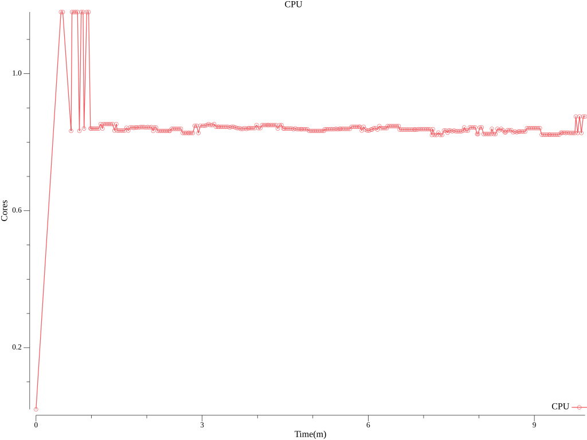
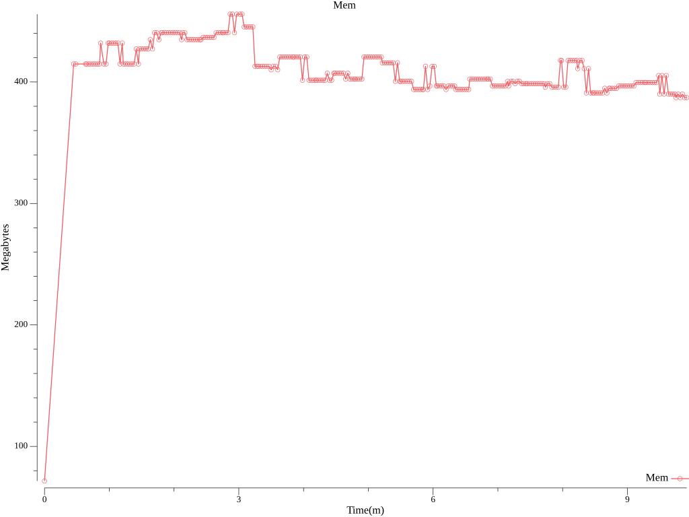
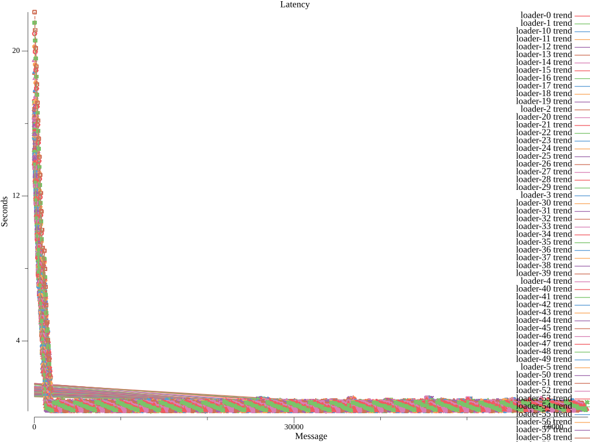
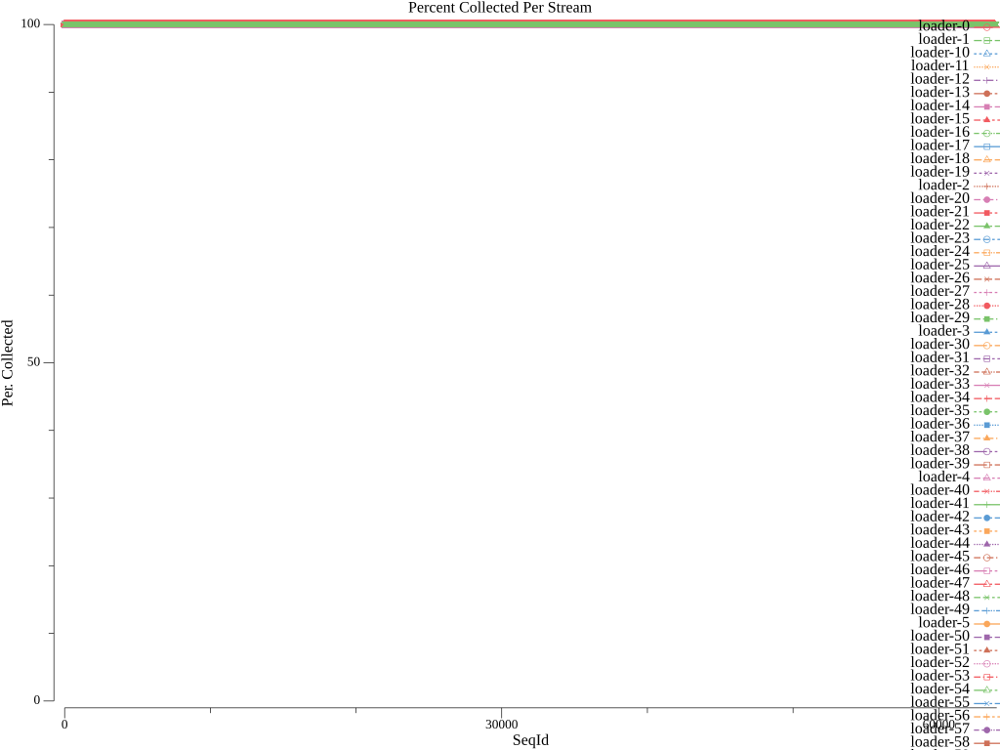

# collector Functionl Benchmark Results
## Options
* Image: quay.io/openshift-logging/vector:v0.37.1
* Total Log Stressors: 100
* Lines Per Second: 70
* Run Duration: 10m
* Payload Source: synthetic

## Latency of logs collected based on the time the log was generated and ingested

Total Msg| Size | Elapsed (s) | Mean (s)| Min(s) | Max (s)| Median (s)
---------|------|-------------|---------|--------|--------|---
5357276|512|10m0s|0.620|0.127|22.153|0.420









## Percent logs lost between first and last collected sequence ids
Stream |  Min Seq | Max Seq | Purged | Collected | Percent Collected |
-------| ---------| --------| -------|-----------|--------------|
| loader-0|0|43329|0|43330|100.0%
| loader-1|0|43539|0|43540|100.0%
| loader-10|0|43679|0|43680|100.0%
| loader-11|0|43819|0|43820|100.0%
| loader-12|0|44099|0|44100|100.0%
| loader-13|0|44309|0|44310|100.0%
| loader-14|0|44519|0|44520|100.0%
| loader-15|0|44659|0|44660|100.0%
| loader-16|0|44939|0|44940|100.0%
| loader-17|0|45079|0|45080|100.0%
| loader-18|0|45289|0|45290|100.0%
| loader-19|0|45499|0|45500|100.0%
| loader-2|0|45849|0|45850|100.0%
| loader-20|0|45919|0|45920|100.0%
| loader-21|0|46269|0|46270|100.0%
| loader-22|0|46479|0|46480|100.0%
| loader-23|0|46689|0|46690|100.0%
| loader-24|0|46969|0|46970|100.0%
| loader-25|0|47109|0|47110|100.0%
| loader-26|0|47319|0|47320|100.0%
| loader-27|0|47529|0|47530|100.0%
| loader-28|0|47739|0|47740|100.0%
| loader-29|0|47879|0|47880|100.0%
| loader-3|0|48229|0|48230|100.0%
| loader-30|0|48299|0|48300|100.0%
| loader-31|0|48509|0|48510|100.0%
| loader-32|0|48719|0|48720|100.0%
| loader-33|0|48929|0|48930|100.0%
| loader-34|0|49139|0|49140|100.0%
| loader-35|0|49349|0|49350|100.0%
| loader-36|0|49559|0|49560|100.0%
| loader-37|0|49839|0|49840|100.0%
| loader-38|0|50049|0|50050|100.0%
| loader-39|0|50259|0|50260|100.0%
| loader-4|0|50749|0|50750|100.0%
| loader-40|0|50679|0|50680|100.0%
| loader-41|0|50889|0|50890|100.0%
| loader-42|0|51099|0|51100|100.0%
| loader-43|0|51309|0|51310|100.0%
| loader-44|0|51449|0|51450|100.0%
| loader-45|0|51659|0|51660|100.0%
| loader-46|0|51799|0|51800|100.0%
| loader-47|0|52009|0|52010|100.0%
| loader-48|0|52289|0|52290|100.0%
| loader-49|0|52429|0|52430|100.0%
| loader-5|0|52919|0|52920|100.0%
| loader-50|0|52849|0|52850|100.0%
| loader-51|0|53059|0|53060|100.0%
| loader-52|0|53269|0|53270|100.0%
| loader-53|0|53479|0|53480|100.0%
| loader-54|0|53689|0|53690|100.0%
| loader-55|0|53899|0|53900|100.0%
| loader-56|0|54039|0|54040|100.0%
| loader-57|0|54249|0|54250|100.0%
| loader-58|0|54459|0|54460|100.0%
| loader-59|0|54599|0|54600|100.0%
| loader-6|0|55195|0|55196|100.0%
| loader-60|0|55019|0|55020|100.0%
| loader-61|0|55229|0|55230|100.0%
| loader-62|0|55369|0|55370|100.0%
| loader-63|0|55649|0|55650|100.0%
| loader-64|0|55859|0|55860|100.0%
| loader-65|0|56069|0|56070|100.0%
| loader-66|0|56279|0|56280|100.0%
| loader-67|0|56489|0|56490|100.0%
| loader-68|0|56629|0|56630|100.0%
| loader-69|0|56909|0|56910|100.0%
| loader-7|0|57539|0|57540|100.0%
| loader-70|0|57259|0|57260|100.0%
| loader-71|0|57469|0|57470|100.0%
| loader-72|0|57679|0|57680|100.0%
| loader-73|0|57819|0|57820|100.0%
| loader-74|0|58029|0|58030|100.0%
| loader-75|0|58239|0|58240|100.0%
| loader-76|0|58449|0|58450|100.0%
| loader-77|0|58659|0|58660|100.0%
| loader-78|0|58799|0|58800|100.0%
| loader-79|0|59009|0|59010|100.0%
| loader-8|0|59709|0|59710|100.0%
| loader-80|0|59429|0|59430|100.0%
| loader-81|0|59639|0|59640|100.0%
| loader-82|0|59849|0|59850|100.0%
| loader-83|0|60059|0|60060|100.0%
| loader-84|0|60479|0|60480|100.0%
| loader-85|0|60619|0|60620|100.0%
| loader-86|0|60899|0|60900|100.0%
| loader-87|0|61179|0|61180|100.0%
| loader-88|0|61389|0|61390|100.0%
| loader-89|0|61599|0|61600|100.0%
| loader-9|0|62369|0|62370|100.0%
| loader-90|0|62019|0|62020|100.0%
| loader-91|0|62299|0|62300|100.0%
| loader-92|0|62509|0|62510|100.0%
| loader-93|0|62649|0|62650|100.0%
| loader-94|0|62859|0|62860|100.0%
| loader-95|0|63139|0|63140|100.0%
| loader-96|0|63279|0|63280|100.0%
| loader-97|0|63489|0|63490|100.0%
| loader-98|0|63839|0|63840|100.0%
| loader-99|0|63979|0|63980|100.0%


## Config

```
expire_metrics_secs = 60
data_dir = "/var/lib/vector/testhack-grw7vyuy/functional"

[api]
enabled = true

# Load sensitive data from files
[secret.kubernetes_secret]
type = "file"
base_path = "/var/run/ocp-collector/secrets"

[sources.internal_metrics]
type = "internal_metrics"

# Logs from containers (including openshift containers)
[sources.input_benchmark_container]
type = "kubernetes_logs"
max_read_bytes = 3145728
glob_minimum_cooldown_ms = 15000
auto_partial_merge = true
include_paths_glob_patterns = ["/var/log/pods/testhack-grw7vyuy_*/*/*.log"]
exclude_paths_glob_patterns = ["/var/log/pods/*/*/*.gz", "/var/log/pods/*/*/*.log.*", "/var/log/pods/*/*/*.tmp", "/var/log/pods/*/collector/*.log", "/var/log/pods/*/http/*.log", "/var/log/pods/default_*/*/*.log", "/var/log/pods/kube-*_*/*/*.log", "/var/log/pods/kube_*/*/*.log", "/var/log/pods/openshift-*_*/*/*.log", "/var/log/pods/openshift_*/*/*.log"]
pod_annotation_fields.pod_labels = "kubernetes.labels"
pod_annotation_fields.pod_namespace = "kubernetes.namespace_name"
pod_annotation_fields.pod_annotations = "kubernetes.annotations"
pod_annotation_fields.pod_uid = "kubernetes.pod_id"
pod_annotation_fields.pod_node_name = "hostname"
namespace_annotation_fields.namespace_uid = "kubernetes.namespace_id"
rotate_wait_secs = 5

[transforms.input_benchmark_container_meta]
type = "remap"
inputs = ["input_benchmark_container"]
source = '''
  .log_source = "container"
  # If namespace is infra, label log_type as infra
  if match_any(string!(.kubernetes.namespace_name), [r'^default$', r'^openshift(-.+)?$', r'^kube(-.+)?$']) {
      .log_type = "infrastructure"
  } else {
      .log_type = "application"
  }
'''

[transforms.pipeline_forward_pipeline_viaq_0]
type = "remap"
inputs = ["input_benchmark_container_meta"]
source = '''
  if .log_source == "container" {
    .openshift.cluster_id = "${OPENSHIFT_CLUSTER_ID:-}"
  if !exists(.level) {
    .level = "default"
    # Match on well known structured patterns
    # Order: emergency, alert, critical, error, warn, notice, info, debug, trace
    if match!(.message, r'^EM[0-9]+|level=emergency|Value:emergency|"level":"emergency"') {
      .level = "emergency"
    } else if match!(.message, r'^A[0-9]+|level=alert|Value:alert|"level":"alert"') {
      .level = "alert"
    } else if match!(.message, r'^C[0-9]+|level=critical|Value:critical|"level":"critical"') {
      .level = "critical"
    } else if match!(.message, r'^E[0-9]+|level=error|Value:error|"level":"error"') {
      .level = "error"
    } else if match!(.message, r'^W[0-9]+|level=warn|Value:warn|"level":"warn"') {
      .level = "warn"
    } else if match!(.message, r'^N[0-9]+|level=notice|Value:notice|"level":"notice"') {
      .level = "notice"
    } else if match!(.message, r'^I[0-9]+|level=info|Value:info|"level":"info"') {
      .level = "info"
    } else if match!(.message, r'^D[0-9]+|level=debug|Value:debug|"level":"debug"') {
      .level = "debug"
    } else if match!(.message, r'^T[0-9]+|level=trace|Value:trace|"level":"trace"') {
      .level = "trace"
    }
    # Match on unstructured keywords in same order
    if .level == "default" {
      if match!(.message, r'Emergency|EMERGENCY|<emergency>') {
        .level = "emergency"
      } else if match!(.message, r'Alert|ALERT|<alert>') {
        .level = "alert"
      } else if match!(.message, r'Critical|CRITICAL|<critical>') {
        .level = "critical"
      } else if match!(.message, r'Error|ERROR|<error>') {
        .level = "error"
      } else if match!(.message, r'Warning|WARN|<warn>') {
        .level = "warn"
      } else if match!(.message, r'Notice|NOTICE|<notice>') {
        .level = "notice"
      } else if match!(.message, r'(?i)\b(?:info)\b|<info>') {
        .level = "info"
      } else if match!(.message, r'Debug|DEBUG|<debug>') {
        .level = "debug"
      } else if match!(.message, r'Trace|TRACE|<trace>') {
        .level = "trace"
      }
    }
  }
  pod_name = string!(.kubernetes.pod_name)
  if starts_with(pod_name, "eventrouter-") {
    parsed, err = parse_json(.message)
    if err != null {
      log("Unable to process EventRouter log: " + err, level: "info")
    } else {
      ., err = merge(.,parsed)
      if err == null && exists(.event) && is_object(.event) {
          if exists(.verb) {
            .event.verb = .verb
            del(.verb)
          }
          .kubernetes.event = del(.event)
          .message = del(.kubernetes.event.message)
          . = set!(., ["@timestamp"], .kubernetes.event.metadata.creationTimestamp)
          del(.kubernetes.event.metadata.creationTimestamp)
  		. = compact(., nullish: true)
      } else {
        log("Unable to merge EventRouter log message into record: " + err, level: "info")
      }
    }
  }
  del(._partial)
  del(.file)
  del(.source_type)
  .kubernetes.container_iostream = del(.stream)
  del(.kubernetes.pod_ips)
  del(.kubernetes.node_labels)
  del(.timestamp_end)
  if !exists(."@timestamp") {."@timestamp" = .timestamp}
  .openshift.sequence = to_unix_timestamp(now(), unit: "nanoseconds")
  }
'''

[transforms.pipeline_forward_pipeline_viaqdedot_1]
type = "remap"
inputs = ["pipeline_forward_pipeline_viaq_0"]
source = '''
  if .log_source == "container" {
    if exists(.kubernetes.namespace_labels) {
      ._internal.kubernetes.namespace_labels = .kubernetes.namespace_labels
      for_each(object!(.kubernetes.namespace_labels)) -> |key,value| { 
        newkey = replace(key, r'[\./]', "_") 
        .kubernetes.namespace_labels = set!(.kubernetes.namespace_labels,[newkey],value)
        if newkey != key {.kubernetes.namespace_labels = remove!(.kubernetes.namespace_labels,[key],true)}
      }
    }
    if exists(.kubernetes.labels) {
      ._internal.kubernetes.labels = .kubernetes.labels
      for_each(object!(.kubernetes.labels)) -> |key,value| { 
        newkey = replace(key, r'[\./]', "_") 
        .kubernetes.labels = set!(.kubernetes.labels,[newkey],value)
        if newkey != key {.kubernetes.labels = remove!(.kubernetes.labels,[key],true)}
      }
    }
  }
  if exists(.openshift.labels) {for_each(object!(.openshift.labels)) -> |key,value| {
    newkey = replace(key, r'[\./]', "_") 
    .openshift.labels = set!(.openshift.labels,[newkey],value)
    if newkey != key {.openshift.labels = remove!(.openshift.labels,[key],true)}
  }}
'''

[sinks.output_http]
type = "http"
inputs = ["pipeline_forward_pipeline_viaqdedot_1"]
uri = "http://localhost:8090"
method = "post"

[sinks.output_http.encoding]
codec = "json"
except_fields = ["_internal"]

[sinks.output_http.tls]
min_tls_version = "VersionTLS12"
ciphersuites = "TLS_AES_128_GCM_SHA256,TLS_AES_256_GCM_SHA384,TLS_CHACHA20_POLY1305_SHA256,ECDHE-ECDSA-AES128-GCM-SHA256,ECDHE-RSA-AES128-GCM-SHA256,ECDHE-ECDSA-AES256-GCM-SHA384,ECDHE-RSA-AES256-GCM-SHA384,ECDHE-ECDSA-CHACHA20-POLY1305,ECDHE-RSA-CHACHA20-POLY1305,DHE-RSA-AES128-GCM-SHA256,DHE-RSA-AES256-GCM-SHA384"

[transforms.add_nodename_to_metric]
type = "remap"
inputs = ["internal_metrics"]
source = '''
.tags.hostname = get_env_var!("VECTOR_SELF_NODE_NAME")
'''

[sinks.prometheus_output]
type = "prometheus_exporter"
inputs = ["add_nodename_to_metric"]
address = "[::]:24231"
default_namespace = "collector"

[sinks.prometheus_output.tls]
enabled = true
key_file = "/etc/collector/metrics/tls.key"
crt_file = "/etc/collector/metrics/tls.crt"
min_tls_version = "VersionTLS12"
ciphersuites = "TLS_AES_128_GCM_SHA256,TLS_AES_256_GCM_SHA384,TLS_CHACHA20_POLY1305_SHA256,ECDHE-ECDSA-AES128-GCM-SHA256,ECDHE-RSA-AES128-GCM-SHA256,ECDHE-ECDSA-AES256-GCM-SHA384,ECDHE-RSA-AES256-GCM-SHA384,ECDHE-ECDSA-CHACHA20-POLY1305,ECDHE-RSA-CHACHA20-POLY1305,DHE-RSA-AES128-GCM-SHA256,DHE-RSA-AES256-GCM-SHA384"
```

