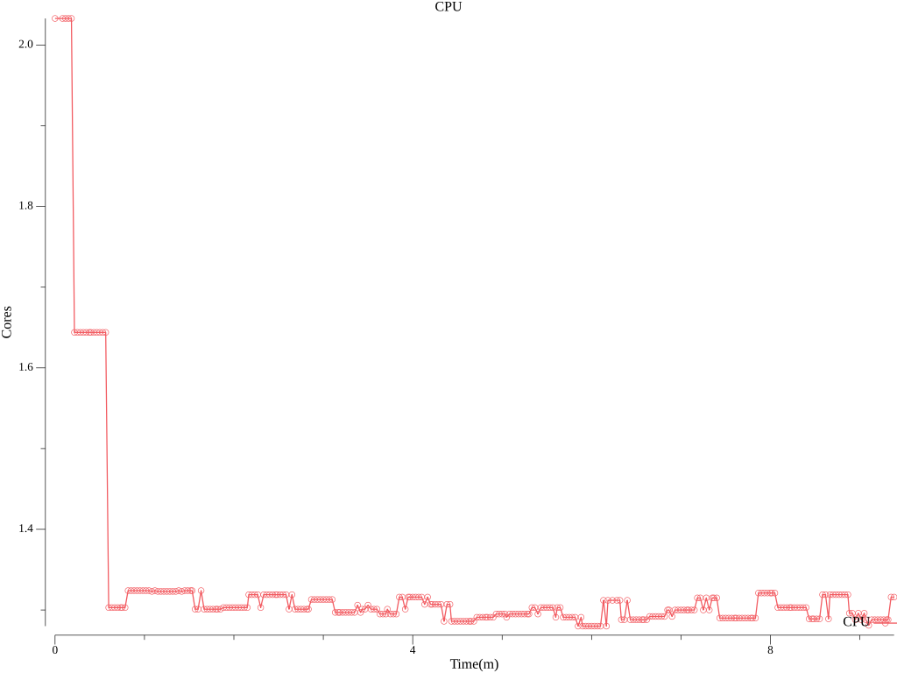
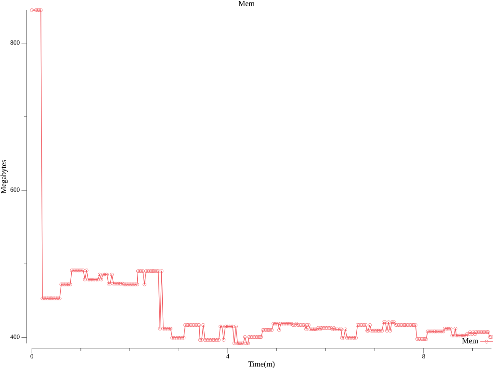
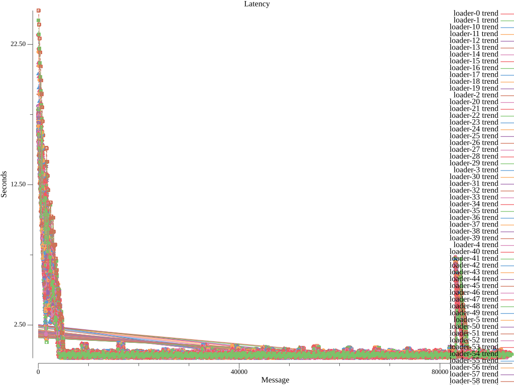
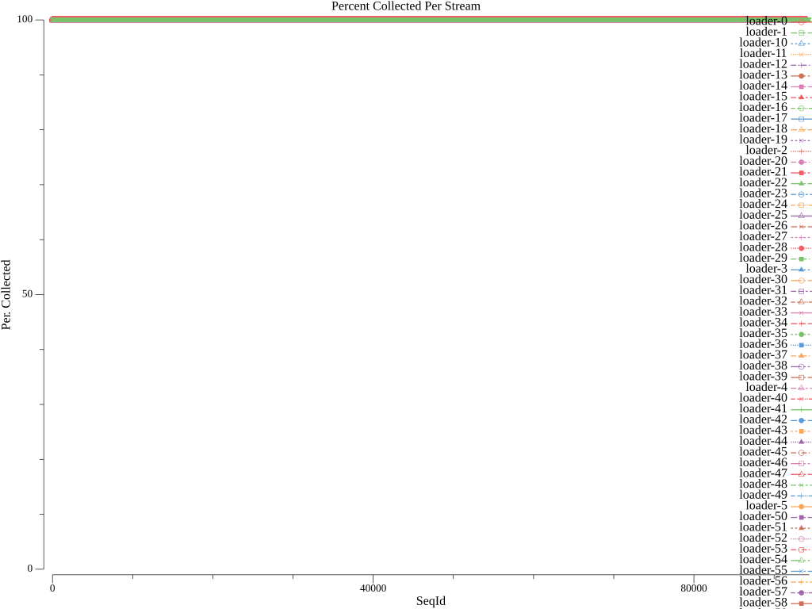

# collector Functionl Benchmark Results
## Options
* Image: quay.io/openshift-logging/vector:v0.37.1
* Total Log Stressors: 100
* Lines Per Second: 100
* Run Duration: 10m
* Payload Source: synthetic

## Latency of logs collected based on the time the log was generated and ingested

Total Msg| Size | Elapsed (s) | Mean (s)| Min(s) | Max (s)| Median (s)
---------|------|-------------|---------|--------|--------|---
7772191|512|10m0s|0.802|0.132|24.916|0.373









## Percent logs lost between first and last collected sequence ids
Stream |  Min Seq | Max Seq | Purged | Collected | Percent Collected |
-------| ---------| --------| -------|-----------|--------------|
| loader-0|0|61999|0|62000|100.0%
| loader-1|0|62299|0|62300|100.0%
| loader-10|0|62599|0|62600|100.0%
| loader-11|0|62999|0|63000|100.0%
| loader-12|0|63299|0|63300|100.0%
| loader-13|0|63499|0|63500|100.0%
| loader-14|0|63799|0|63800|100.0%
| loader-15|0|64199|0|64200|100.0%
| loader-16|0|64499|0|64500|100.0%
| loader-17|0|64699|0|64700|100.0%
| loader-18|0|64999|0|65000|100.0%
| loader-19|0|65399|0|65400|100.0%
| loader-2|0|65799|0|65800|100.0%
| loader-20|0|65899|0|65900|100.0%
| loader-21|0|66299|0|66300|100.0%
| loader-22|0|66599|0|66600|100.0%
| loader-23|0|66899|0|66900|100.0%
| loader-24|0|67199|0|67200|100.0%
| loader-25|0|67499|0|67500|100.0%
| loader-26|0|67799|0|67800|100.0%
| loader-27|0|68199|0|68200|100.0%
| loader-28|0|68399|0|68400|100.0%
| loader-29|0|68799|0|68800|100.0%
| loader-3|0|69299|0|69300|100.0%
| loader-30|0|69299|0|69300|100.0%
| loader-31|0|69699|0|69700|100.0%
| loader-32|0|70099|0|70100|100.0%
| loader-33|0|70299|0|70300|100.0%
| loader-34|0|70599|0|70600|100.0%
| loader-35|0|70899|0|70900|100.0%
| loader-36|0|71199|0|71200|100.0%
| loader-37|0|71451|0|71452|100.0%
| loader-38|0|71699|0|71700|100.0%
| loader-39|0|71999|0|72000|100.0%
| loader-4|0|72699|0|72700|100.0%
| loader-40|0|72614|0|72615|100.0%
| loader-41|0|72999|0|73000|100.0%
| loader-42|0|73299|0|73300|100.0%
| loader-43|0|73499|0|73500|100.0%
| loader-44|0|73999|0|74000|100.0%
| loader-45|0|74399|0|74400|100.0%
| loader-46|0|74699|0|74700|100.0%
| loader-47|0|74999|0|75000|100.0%
| loader-48|0|75299|0|75300|100.0%
| loader-49|0|75599|0|75600|100.0%
| loader-5|0|76399|0|76400|100.0%
| loader-50|0|76199|0|76200|100.0%
| loader-51|0|76599|0|76600|100.0%
| loader-52|0|76899|0|76900|100.0%
| loader-53|0|77199|0|77200|100.0%
| loader-54|0|77699|0|77700|100.0%
| loader-55|0|59523|0|59524|100.0%
| loader-56|0|78799|0|78800|100.0%
| loader-57|0|79099|0|79100|100.0%
| loader-58|0|79399|0|79400|100.0%
| loader-59|0|79699|0|79700|100.0%
| loader-6|0|80599|0|80600|100.0%
| loader-60|0|80399|0|80400|100.0%
| loader-61|0|80799|0|80800|100.0%
| loader-62|0|80999|0|81000|100.0%
| loader-63|0|81399|0|81400|100.0%
| loader-64|0|81699|0|81700|100.0%
| loader-65|0|82099|0|82100|100.0%
| loader-66|0|82399|0|82400|100.0%
| loader-67|0|82799|0|82800|100.0%
| loader-68|0|83199|0|83200|100.0%
| loader-69|0|83299|0|83300|100.0%
| loader-7|0|84099|0|84100|100.0%
| loader-70|0|83799|0|83800|100.0%
| loader-71|0|84199|0|84200|100.0%
| loader-72|0|84699|0|84700|100.0%
| loader-73|0|84999|0|85000|100.0%
| loader-74|0|85399|0|85400|100.0%
| loader-75|0|85699|0|85700|100.0%
| loader-76|0|86099|0|86100|100.0%
| loader-77|0|86399|0|86400|100.0%
| loader-78|0|86699|0|86700|100.0%
| loader-79|0|86999|0|87000|100.0%
| loader-8|0|88199|0|88200|100.0%
| loader-80|0|87699|0|87700|100.0%
| loader-81|0|87999|0|88000|100.0%
| loader-82|0|88399|0|88400|100.0%
| loader-83|0|88699|0|88700|100.0%
| loader-84|0|88999|0|89000|100.0%
| loader-85|0|89399|0|89400|100.0%
| loader-86|0|89699|0|89700|100.0%
| loader-87|0|89999|0|90000|100.0%
| loader-88|0|90399|0|90400|100.0%
| loader-89|0|90799|0|90800|100.0%
| loader-9|0|91999|0|92000|100.0%
| loader-90|0|91499|0|91500|100.0%
| loader-91|0|91799|0|91800|100.0%
| loader-92|0|92099|0|92100|100.0%
| loader-93|0|92399|0|92400|100.0%
| loader-94|0|92699|0|92700|100.0%
| loader-95|0|93099|0|93100|100.0%
| loader-96|0|93399|0|93400|100.0%
| loader-97|0|93699|0|93700|100.0%
| loader-98|0|94099|0|94100|100.0%
| loader-99|0|94399|0|94400|100.0%


## Config

```
expire_metrics_secs = 60
data_dir = "/var/lib/vector/testhack-hgzaaxlg/functional"

[api]
enabled = true

# Load sensitive data from files
[secret.kubernetes_secret]
type = "file"
base_path = "/var/run/ocp-collector/secrets"

[sources.internal_metrics]
type = "internal_metrics"

# Logs from containers (including openshift containers)
[sources.input_benchmark_container]
type = "kubernetes_logs"
max_read_bytes = 3145728
glob_minimum_cooldown_ms = 15000
auto_partial_merge = true
include_paths_glob_patterns = ["/var/log/pods/testhack-hgzaaxlg_*/*/*.log"]
exclude_paths_glob_patterns = ["/var/log/pods/*/*/*.gz", "/var/log/pods/*/*/*.log.*", "/var/log/pods/*/*/*.tmp", "/var/log/pods/*/collector/*.log", "/var/log/pods/*/http/*.log", "/var/log/pods/default_*/*/*.log", "/var/log/pods/kube-*_*/*/*.log", "/var/log/pods/kube_*/*/*.log", "/var/log/pods/openshift-*_*/*/*.log", "/var/log/pods/openshift_*/*/*.log"]
pod_annotation_fields.pod_labels = "kubernetes.labels"
pod_annotation_fields.pod_namespace = "kubernetes.namespace_name"
pod_annotation_fields.pod_annotations = "kubernetes.annotations"
pod_annotation_fields.pod_uid = "kubernetes.pod_id"
pod_annotation_fields.pod_node_name = "hostname"
namespace_annotation_fields.namespace_uid = "kubernetes.namespace_id"
rotate_wait_secs = 5

[transforms.input_benchmark_container_meta]
type = "remap"
inputs = ["input_benchmark_container"]
source = '''
  .log_source = "container"
  # If namespace is infra, label log_type as infra
  if match_any(string!(.kubernetes.namespace_name), [r'^default$', r'^openshift(-.+)?$', r'^kube(-.+)?$']) {
      .log_type = "infrastructure"
  } else {
      .log_type = "application"
  }
'''

[transforms.pipeline_forward_pipeline_viaq_0]
type = "remap"
inputs = ["input_benchmark_container_meta"]
source = '''
  if .log_source == "container" {
    .openshift.cluster_id = "${OPENSHIFT_CLUSTER_ID:-}"
  if !exists(.level) {
    .level = "default"
    # Match on well known structured patterns
    # Order: emergency, alert, critical, error, warn, notice, info, debug, trace
    if match!(.message, r'^EM[0-9]+|level=emergency|Value:emergency|"level":"emergency"') {
      .level = "emergency"
    } else if match!(.message, r'^A[0-9]+|level=alert|Value:alert|"level":"alert"') {
      .level = "alert"
    } else if match!(.message, r'^C[0-9]+|level=critical|Value:critical|"level":"critical"') {
      .level = "critical"
    } else if match!(.message, r'^E[0-9]+|level=error|Value:error|"level":"error"') {
      .level = "error"
    } else if match!(.message, r'^W[0-9]+|level=warn|Value:warn|"level":"warn"') {
      .level = "warn"
    } else if match!(.message, r'^N[0-9]+|level=notice|Value:notice|"level":"notice"') {
      .level = "notice"
    } else if match!(.message, r'^I[0-9]+|level=info|Value:info|"level":"info"') {
      .level = "info"
    } else if match!(.message, r'^D[0-9]+|level=debug|Value:debug|"level":"debug"') {
      .level = "debug"
    } else if match!(.message, r'^T[0-9]+|level=trace|Value:trace|"level":"trace"') {
      .level = "trace"
    }
    # Match on unstructured keywords in same order
    if .level == "default" {
      if match!(.message, r'Emergency|EMERGENCY|<emergency>') {
        .level = "emergency"
      } else if match!(.message, r'Alert|ALERT|<alert>') {
        .level = "alert"
      } else if match!(.message, r'Critical|CRITICAL|<critical>') {
        .level = "critical"
      } else if match!(.message, r'Error|ERROR|<error>') {
        .level = "error"
      } else if match!(.message, r'Warning|WARN|<warn>') {
        .level = "warn"
      } else if match!(.message, r'Notice|NOTICE|<notice>') {
        .level = "notice"
      } else if match!(.message, r'(?i)\b(?:info)\b|<info>') {
        .level = "info"
      } else if match!(.message, r'Debug|DEBUG|<debug>') {
        .level = "debug"
      } else if match!(.message, r'Trace|TRACE|<trace>') {
        .level = "trace"
      }
    }
  }
  pod_name = string!(.kubernetes.pod_name)
  if starts_with(pod_name, "eventrouter-") {
    parsed, err = parse_json(.message)
    if err != null {
      log("Unable to process EventRouter log: " + err, level: "info")
    } else {
      ., err = merge(.,parsed)
      if err == null && exists(.event) && is_object(.event) {
          if exists(.verb) {
            .event.verb = .verb
            del(.verb)
          }
          .kubernetes.event = del(.event)
          .message = del(.kubernetes.event.message)
          . = set!(., ["@timestamp"], .kubernetes.event.metadata.creationTimestamp)
          del(.kubernetes.event.metadata.creationTimestamp)
  		. = compact(., nullish: true)
      } else {
        log("Unable to merge EventRouter log message into record: " + err, level: "info")
      }
    }
  }
  del(._partial)
  del(.file)
  del(.source_type)
  .kubernetes.container_iostream = del(.stream)
  del(.kubernetes.pod_ips)
  del(.kubernetes.node_labels)
  del(.timestamp_end)
  if !exists(."@timestamp") {."@timestamp" = .timestamp}
  .openshift.sequence = to_unix_timestamp(now(), unit: "nanoseconds")
  }
'''

[transforms.pipeline_forward_pipeline_viaqdedot_1]
type = "remap"
inputs = ["pipeline_forward_pipeline_viaq_0"]
source = '''
  if .log_source == "container" {
    if exists(.kubernetes.namespace_labels) {
      ._internal.kubernetes.namespace_labels = .kubernetes.namespace_labels
      for_each(object!(.kubernetes.namespace_labels)) -> |key,value| { 
        newkey = replace(key, r'[\./]', "_") 
        .kubernetes.namespace_labels = set!(.kubernetes.namespace_labels,[newkey],value)
        if newkey != key {.kubernetes.namespace_labels = remove!(.kubernetes.namespace_labels,[key],true)}
      }
    }
    if exists(.kubernetes.labels) {
      ._internal.kubernetes.labels = .kubernetes.labels
      for_each(object!(.kubernetes.labels)) -> |key,value| { 
        newkey = replace(key, r'[\./]', "_") 
        .kubernetes.labels = set!(.kubernetes.labels,[newkey],value)
        if newkey != key {.kubernetes.labels = remove!(.kubernetes.labels,[key],true)}
      }
    }
  }
  if exists(.openshift.labels) {for_each(object!(.openshift.labels)) -> |key,value| {
    newkey = replace(key, r'[\./]', "_") 
    .openshift.labels = set!(.openshift.labels,[newkey],value)
    if newkey != key {.openshift.labels = remove!(.openshift.labels,[key],true)}
  }}
'''

[sinks.output_http]
type = "http"
inputs = ["pipeline_forward_pipeline_viaqdedot_1"]
uri = "http://localhost:8090"
method = "post"

[sinks.output_http.encoding]
codec = "json"
except_fields = ["_internal"]

[sinks.output_http.tls]
min_tls_version = "VersionTLS12"
ciphersuites = "TLS_AES_128_GCM_SHA256,TLS_AES_256_GCM_SHA384,TLS_CHACHA20_POLY1305_SHA256,ECDHE-ECDSA-AES128-GCM-SHA256,ECDHE-RSA-AES128-GCM-SHA256,ECDHE-ECDSA-AES256-GCM-SHA384,ECDHE-RSA-AES256-GCM-SHA384,ECDHE-ECDSA-CHACHA20-POLY1305,ECDHE-RSA-CHACHA20-POLY1305,DHE-RSA-AES128-GCM-SHA256,DHE-RSA-AES256-GCM-SHA384"

[transforms.add_nodename_to_metric]
type = "remap"
inputs = ["internal_metrics"]
source = '''
.tags.hostname = get_env_var!("VECTOR_SELF_NODE_NAME")
'''

[sinks.prometheus_output]
type = "prometheus_exporter"
inputs = ["add_nodename_to_metric"]
address = "[::]:24231"
default_namespace = "collector"

[sinks.prometheus_output.tls]
enabled = true
key_file = "/etc/collector/metrics/tls.key"
crt_file = "/etc/collector/metrics/tls.crt"
min_tls_version = "VersionTLS12"
ciphersuites = "TLS_AES_128_GCM_SHA256,TLS_AES_256_GCM_SHA384,TLS_CHACHA20_POLY1305_SHA256,ECDHE-ECDSA-AES128-GCM-SHA256,ECDHE-RSA-AES128-GCM-SHA256,ECDHE-ECDSA-AES256-GCM-SHA384,ECDHE-RSA-AES256-GCM-SHA384,ECDHE-ECDSA-CHACHA20-POLY1305,ECDHE-RSA-CHACHA20-POLY1305,DHE-RSA-AES128-GCM-SHA256,DHE-RSA-AES256-GCM-SHA384"
```

