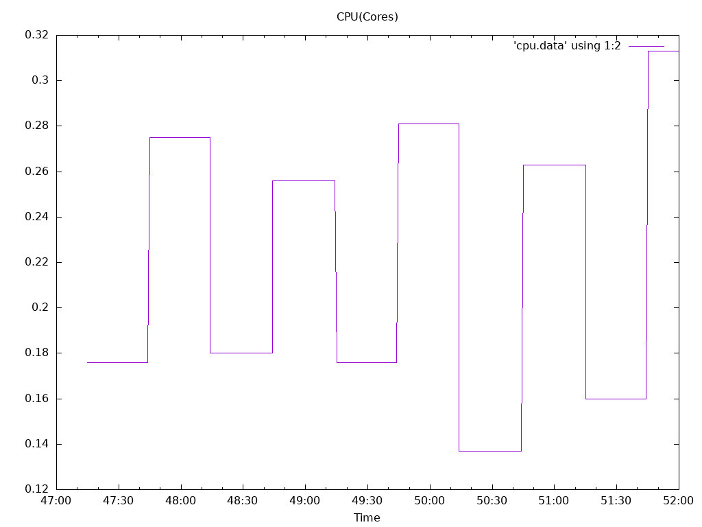
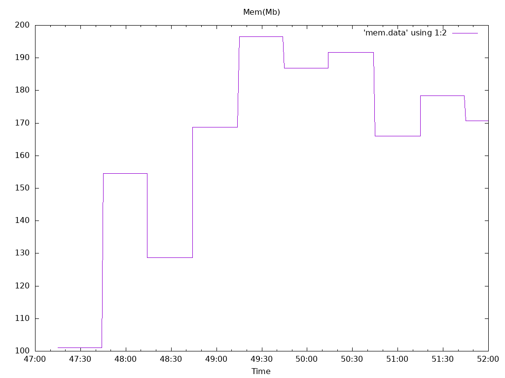

# collector Functionl Benchmark Results
## Options
* Image: quay.io/openshift-logging/fluentd:1.14.6
* Total Log Stressors: 1
* Lines Per Second: 1000
* Run Duration: 5m
* Payload Source: synthetic

## Latency of logs collected based on the time the log was generated and ingested

Total Msg| Size | Elapsed (s) | Mean (s)| Min(s) | Max (s)| Median (s)
---------|------|-------------|---------|--------|--------|---
0|0|0s|0.000|0.000|0.0000.000

## Percent logs lost between first and last collected sequence ids
Stream |  Min Seq | Max Seq | Purged | Collected | Percent Collected |
-------| ---------| --------| -------|-----------|--------------|

## Config
<code style="white-space:pre;">

<system>
  log_level debug
</system>

<source>
  @type tail
  @id container-input
  path /var/log/pods/**/*
  exclude_path ["/var/log/pods/**/*/*.gz","/var/log/pods/**/*/*.tmp"]
  pos_file "/var/lib/fluentd/pos/containers-app"
  refresh_interval 5
  rotate_wait 5
  tag kubernetes.*
  read_from_head "true"
  <parse>
    @type regexp
    expression /^(?<@timestamp>[^\s]+) (?<stream>stdout|stderr) (?<logtag>[F|P]) (?<message>.*)$/
    time_format '%Y-%m-%dT%H:%M:%S.%N%:z'
    keep_time_key true
  </parse>
</source>

<filter kubernetes.**>
	@type concat
	key message
	partial_key logtag
	partial_value P
	separator ''
</filter>

<match **>
	@type forward
	heartbeat_type none
	keepalive true
	
	<buffer>
	  flush_mode interval
	  flush_interval 5s
	  flush_at_shutdown true
	  flush_thread_count 2
	  retry_type exponential_backoff
	  retry_wait 1s
	  retry_max_interval 60s
	  retry_forever true
	  overflow_action block
	</buffer>
	
	<server>
	  host 0.0.0.0
	  port 24224
	</server>
</match>

</code>
