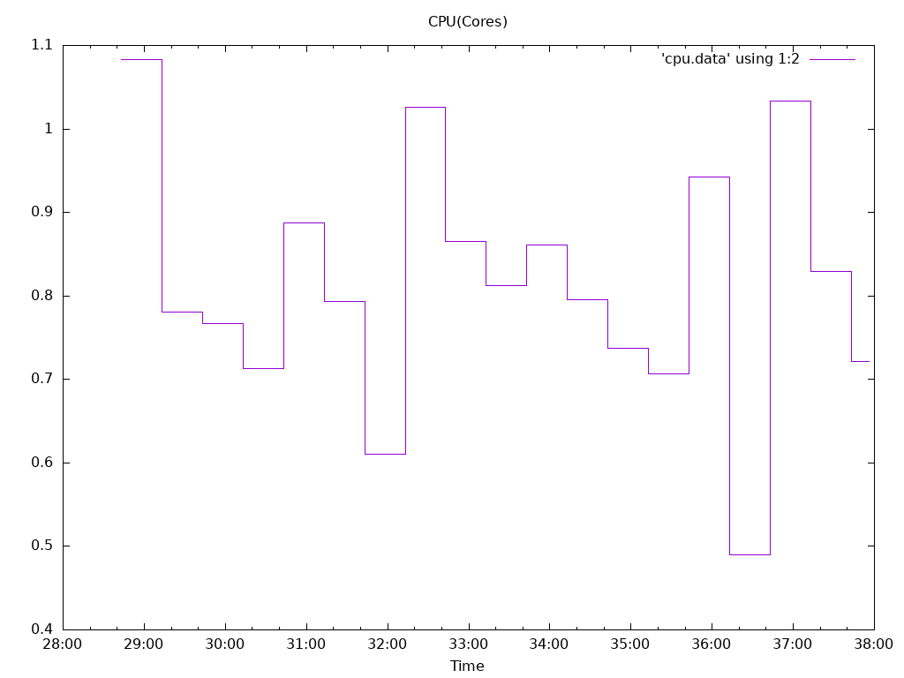
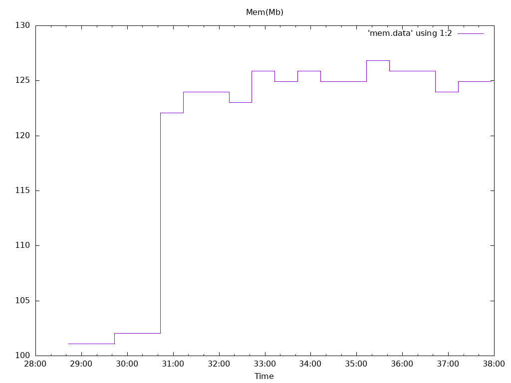
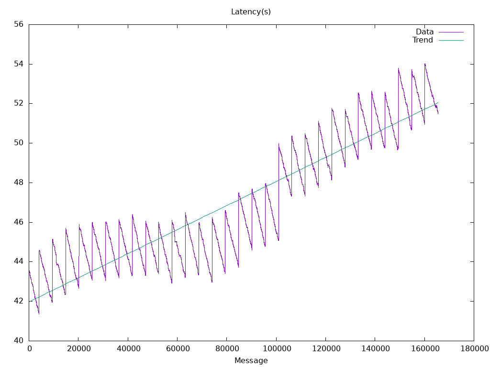

**Options**

Image: quay.io/openshift-logging/fluentd:1.7.4

Total Log Stressors: 1

Lines Per Second: 1500

Run Duration: 10m

Payload Source: synthetic

Latency of logs collected based on the time the log was generated and ingested

Total

Size

Elapsed

Mean

Min

Max

Median

Msg

(s)

(s)

(s)

(s)

(s)

165513

1024

10m0s

47.013

41.343

54.026

45.815

