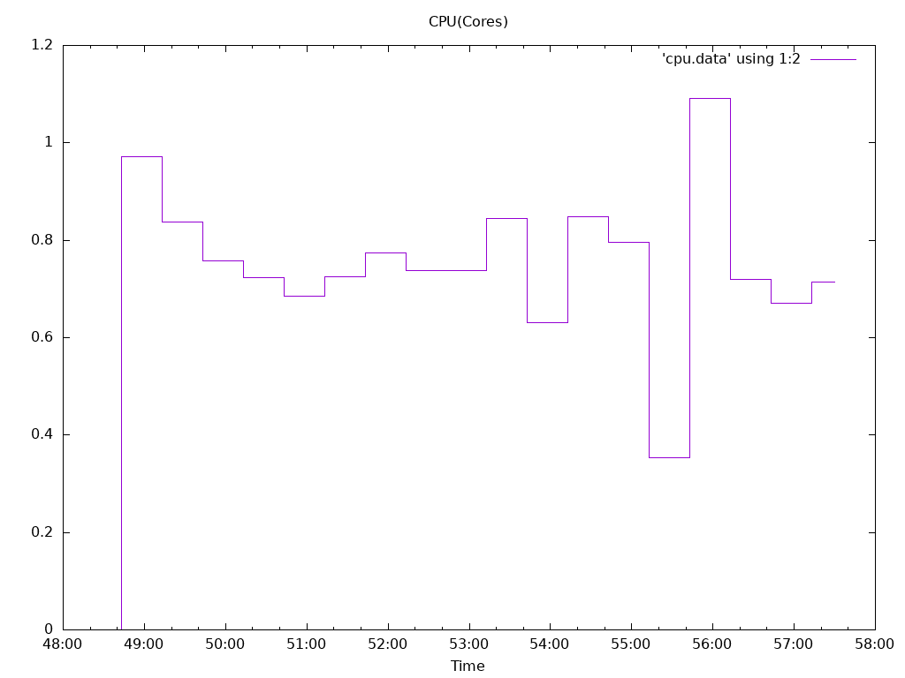
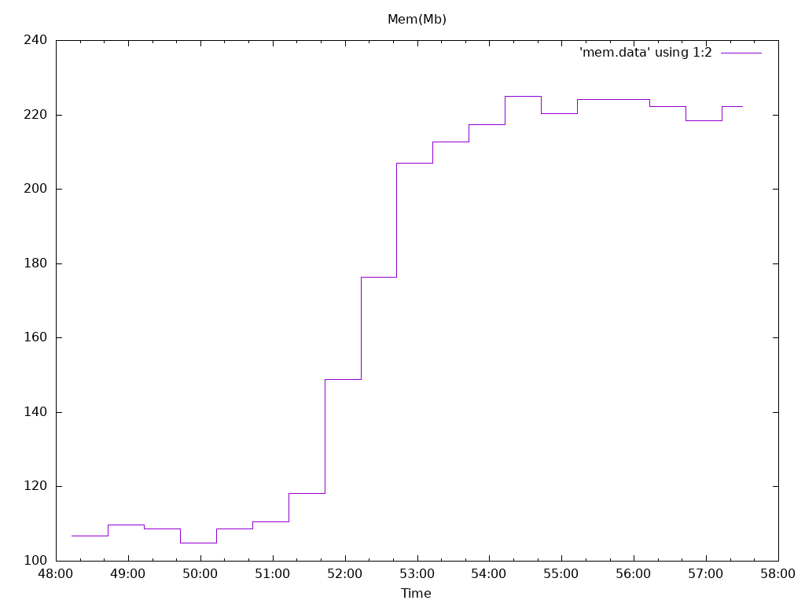
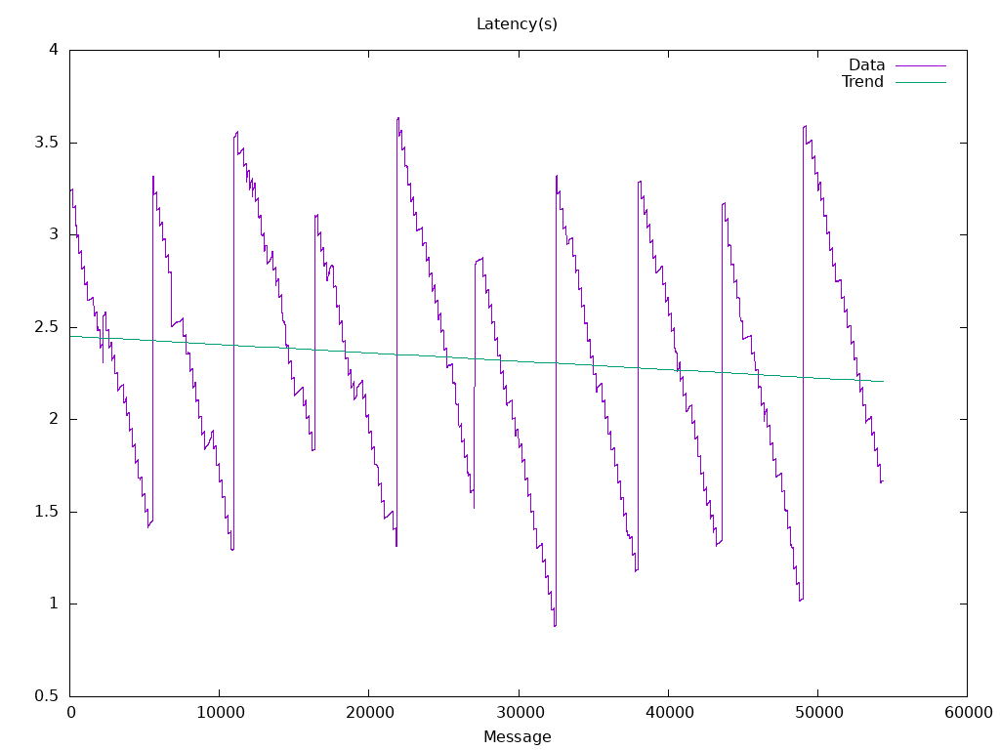

# Collector Functionl Benchmark Results
## Options
* Image: quay.io/openshift-logging/fluentd:1.7.4
* Total Log Stressors: 1
* Lines Per Second: 2000
* Run Duration: 10m
* Payload Source: synthetic

## Latency of logs collected based on the time the log was generated and ingested

Total | Size | Elapsed | Mean | Min | Max | Median
Msg||(s)|(s)|(s)|(s)|(s)
54400|1024|10m0s|2.329|0.880|3.6362.323

## Config
<code>
## CLO GENERATED CONFIGURATION ###
# This file is a copy of the fluentd configuration entrypoint
# which should normally be supplied in a configmap.

&lt;system&gt;
  log_level &#34;#{ENV[&#39;LOG_LEVEL&#39;] || &#39;warn&#39;}&#34;
&lt;/system&gt;

# Prometheus Monitoring
&lt;source&gt;
  @type prometheus
  bind &#34;#{ENV[&#39;POD_IP&#39;]}&#34;
  &lt;ssl&gt;
    enable true
    certificate_path &#34;#{ENV[&#39;METRICS_CERT&#39;] || &#39;/etc/fluent/metrics/tls.crt&#39;}&#34;
    private_key_path &#34;#{ENV[&#39;METRICS_KEY&#39;] || &#39;/etc/fluent/metrics/tls.key&#39;}&#34;
  &lt;/ssl&gt;
&lt;/source&gt;

&lt;source&gt;
  @type prometheus_monitor
  &lt;labels&gt;
    hostname ${hostname}
  &lt;/labels&gt;
&lt;/source&gt;

# excluding prometheus_tail_monitor
# since it leaks namespace/pod info
# via file paths

# tail_monitor plugin which publishes log_collected_bytes_total
&lt;source&gt;
  @type collected_tail_monitor
  &lt;labels&gt;
    hostname ${hostname}
  &lt;/labels&gt;
&lt;/source&gt;

# This is considered experimental by the repo
&lt;source&gt;
  @type prometheus_output_monitor
  &lt;labels&gt;
    hostname ${hostname}
  &lt;/labels&gt;
&lt;/source&gt;

# Logs from containers (including openshift containers)
&lt;source&gt;
  @type tail
  @id container-input
  path &#34;/var/log/containers/*.log&#34;
  exclude_path [&#34;/var/log/containers/collector-*_openshift-logging_*.log&#34;, &#34;/var/log/containers/elasticsearch-*_openshift-logging_*.log&#34;, &#34;/var/log/containers/kibana-*_openshift-logging_*.log&#34;]
  pos_file &#34;/var/lib/fluentd/pos/es-containers.log.pos&#34;
  refresh_interval 5
  rotate_wait 5
  tag kubernetes.*
  read_from_head &#34;true&#34;
  skip_refresh_on_startup true
  @label @MEASURE
  &lt;parse&gt;
    @type multi_format
    &lt;pattern&gt;
      format json
      time_format &#39;%Y-%m-%dT%H:%M:%S.%N%Z&#39;
      keep_time_key true
    &lt;/pattern&gt;
    &lt;pattern&gt;
      format regexp
      expression /^(?&lt;time&gt;[^\s]+) (?&lt;stream&gt;stdout|stderr)( (?&lt;logtag&gt;.))? (?&lt;log&gt;.*)$/
      time_format &#39;%Y-%m-%dT%H:%M:%S.%N%:z&#39;
      keep_time_key true
    &lt;/pattern&gt;
  &lt;/parse&gt;
&lt;/source&gt;

# Increment Prometheus metrics
&lt;label @MEASURE&gt;
  &lt;filter **&gt;
    @type record_transformer
    enable_ruby
    &lt;record&gt;
      msg_size ${record.to_s.length}
    &lt;/record&gt;
  &lt;/filter&gt;
  
  &lt;filter **&gt;
    @type prometheus
    &lt;metric&gt;
      name cluster_logging_collector_input_record_total
      type counter
      desc The total number of incoming records
      &lt;labels&gt;
        tag ${tag}
        hostname ${hostname}
      &lt;/labels&gt;
    &lt;/metric&gt;
  &lt;/filter&gt;
  
  &lt;filter **&gt;
    @type prometheus
    &lt;metric&gt;
      name cluster_logging_collector_input_record_bytes
      type counter
      desc The total bytes of incoming records
      key msg_size
      &lt;labels&gt;
        tag ${tag}
        hostname ${hostname}
      &lt;/labels&gt;
    &lt;/metric&gt;
  &lt;/filter&gt;
  
  &lt;filter **&gt;
    @type record_transformer
    remove_keys msg_size
  &lt;/filter&gt;
  
  # Journal Logs go to INGRESS pipeline
  &lt;match journal&gt;
    @type relabel
    @label @INGRESS
  &lt;/match&gt;
  
  # Audit Logs go to INGRESS pipeline
  &lt;match *audit.log&gt;
    @type relabel
    @label @INGRESS
  &lt;/match&gt;
  
  # Kubernetes Logs go to CONCAT pipeline
  &lt;match kubernetes.**&gt;
    @type relabel
    @label @CONCAT
  &lt;/match&gt;
&lt;/label&gt;

# Concat log lines of container logs, and send to INGRESS pipeline
&lt;label @CONCAT&gt;
  &lt;filter kubernetes.**&gt;
    @type concat
    key log
    partial_key logtag
    partial_value P
    separator &#39;&#39;
  &lt;/filter&gt;
  
  &lt;match kubernetes.**&gt;
    @type relabel
    @label @INGRESS
  &lt;/match&gt;
&lt;/label&gt;

# Ingress pipeline
&lt;label @INGRESS&gt;
  
  # Filter out PRIORITY from journal logs
  &lt;filter journal&gt;
    @type grep
    &lt;exclude&gt;
      key PRIORITY
      pattern ^7$
    &lt;/exclude&gt;
  &lt;/filter&gt;
  
  # Process OVN logs
  &lt;filter ovn-audit.log**&gt;
    @type record_modifier
    &lt;record&gt;
      @timestamp ${DateTime.parse(record[&#39;message&#39;].split(&#39;|&#39;)[0]).rfc3339(6)}
      level ${record[&#39;message&#39;].split(&#39;|&#39;)[3].downcase}
    &lt;/record&gt;
  &lt;/filter&gt;
  
  # Retag Journal logs to specific tags
  &lt;match journal&gt;
    @type rewrite_tag_filter
    # skip to @INGRESS label section
    @label @INGRESS
  
    # see if this is a kibana container for special log handling
    # looks like this:
    # k8s_kibana.a67f366_logging-kibana-1-d90e3_logging_26c51a61-2835-11e6-ad29-fa163e4944d5_f0db49a2
    # we filter these logs through the kibana_transform.conf filter
    &lt;rule&gt;
      key CONTAINER_NAME
      pattern ^k8s_kibana\.
      tag kubernetes.journal.container.kibana
    &lt;/rule&gt;
  
    &lt;rule&gt;
      key CONTAINER_NAME
      pattern ^k8s_[^_]+_logging-eventrouter-[^_]+_
      tag kubernetes.journal.container._default_.kubernetes-event
    &lt;/rule&gt;
  
    # mark logs from default namespace for processing as k8s logs but stored as system logs
    &lt;rule&gt;
      key CONTAINER_NAME
      pattern ^k8s_[^_]+_[^_]+_default_
      tag kubernetes.journal.container._default_
    &lt;/rule&gt;
  
    # mark logs from kube-* namespaces for processing as k8s logs but stored as system logs
    &lt;rule&gt;
      key CONTAINER_NAME
      pattern ^k8s_[^_]+_[^_]+_kube-(.+)_
      tag kubernetes.journal.container._kube-$1_
    &lt;/rule&gt;
  
    # mark logs from openshift-* namespaces for processing as k8s logs but stored as system logs
    &lt;rule&gt;
      key CONTAINER_NAME
      pattern ^k8s_[^_]+_[^_]+_openshift-(.+)_
      tag kubernetes.journal.container._openshift-$1_
    &lt;/rule&gt;
  
    # mark logs from openshift namespace for processing as k8s logs but stored as system logs
    &lt;rule&gt;
      key CONTAINER_NAME
      pattern ^k8s_[^_]+_[^_]+_openshift_
      tag kubernetes.journal.container._openshift_
    &lt;/rule&gt;
  
    # mark fluentd container logs
    &lt;rule&gt;
      key CONTAINER_NAME
      pattern ^k8s_.*fluentd
      tag kubernetes.journal.container.fluentd
    &lt;/rule&gt;
  
    # this is a kubernetes container
    &lt;rule&gt;
      key CONTAINER_NAME
      pattern ^k8s_
      tag kubernetes.journal.container
    &lt;/rule&gt;
  
    # not kubernetes - assume a system log or system container log
    &lt;rule&gt;
      key _TRANSPORT
      pattern .+
      tag journal.system
    &lt;/rule&gt;
  &lt;/match&gt;
  
  # Invoke kubernetes apiserver to get kunbernetes metadata
  &lt;filter kubernetes.**&gt;
    @type kubernetes_metadata
    kubernetes_url &#39;https://kubernetes.default.svc&#39;
    cache_size &#39;1000&#39;
    watch &#39;false&#39;
    use_journal &#39;nil&#39;
    ssl_partial_chain &#39;true&#39;
  &lt;/filter&gt;
  
  # Parse Json fields for container, journal and eventrouter logs
  &lt;filter kubernetes.journal.**&gt;
    @type parse_json_field
    merge_json_log &#39;false&#39;
    preserve_json_log &#39;true&#39;
    json_fields &#39;log,MESSAGE&#39;
  &lt;/filter&gt;
  
  &lt;filter kubernetes.var.log.containers.**&gt;
    @type parse_json_field
    merge_json_log &#39;false&#39;
    preserve_json_log &#39;true&#39;
    json_fields &#39;log,MESSAGE&#39;
  &lt;/filter&gt;
  
  &lt;filter kubernetes.var.log.containers.eventrouter-** kubernetes.var.log.containers.cluster-logging-eventrouter-**&gt;
    @type parse_json_field
    merge_json_log true
    preserve_json_log true
    json_fields &#39;log,MESSAGE&#39;
  &lt;/filter&gt;
  
  # Clean kibana log fields
  &lt;filter **kibana**&gt;
    @type record_transformer
    enable_ruby
    &lt;record&gt;
      log ${record[&#39;err&#39;] || record[&#39;msg&#39;] || record[&#39;MESSAGE&#39;] || record[&#39;log&#39;]}
    &lt;/record&gt;
    remove_keys req,res,msg,name,level,v,pid,err
  &lt;/filter&gt;
  
  # Fix level field in audit logs
  &lt;filter k8s-audit.log**&gt;
    @type record_modifier
    &lt;record&gt;
      k8s_audit_level ${record[&#39;level&#39;]}
    &lt;/record&gt;
  &lt;/filter&gt;
  
  &lt;filter openshift-audit.log**&gt;
    @type record_modifier
    &lt;record&gt;
      openshift_audit_level ${record[&#39;level&#39;]}
    &lt;/record&gt;
  &lt;/filter&gt;
  
  # Viaq Data Model
  &lt;filter **&gt;
    @type viaq_data_model
    elasticsearch_index_prefix_field &#39;viaq_index_name&#39;
    default_keep_fields CEE,time,@timestamp,aushape,ci_job,collectd,docker,fedora-ci,file,foreman,geoip,hostname,ipaddr4,ipaddr6,kubernetes,level,message,namespace_name,namespace_uuid,offset,openstack,ovirt,pid,pipeline_metadata,rsyslog,service,systemd,tags,testcase,tlog,viaq_msg_id
    extra_keep_fields &#39;&#39;
    keep_empty_fields &#39;message&#39;
    use_undefined false
    undefined_name &#39;undefined&#39;
    rename_time true
    rename_time_if_missing false
    src_time_name &#39;time&#39;
    dest_time_name &#39;@timestamp&#39;
    pipeline_type &#39;collector&#39;
    undefined_to_string &#39;false&#39;
    undefined_dot_replace_char &#39;UNUSED&#39;
    undefined_max_num_fields &#39;-1&#39;
    process_kubernetes_events &#39;false&#39;
    &lt;level&gt;
      name warn
      match &#39;Warning|WARN|W[0-9]+|level=warn|Value:warn|&#34;level&#34;:&#34;warn&#34;&#39;
    &lt;/level&gt;
    &lt;level&gt;
      name info
      match &#39;Info|INFO|I[0-9]+|level=info|Value:info|&#34;level&#34;:&#34;info&#34;&#39;
    &lt;/level&gt;
    &lt;level&gt;
      name error
      match &#39;Error|ERROR|E[0-9]+|level=error|Value:error|&#34;level&#34;:&#34;error&#34;&#39;
    &lt;/level&gt;
    &lt;level&gt;
      name debug
      match &#39;Debug|DEBUG|D[0-9]+|level=debug|Value:debug|&#34;level&#34;:&#34;debug&#34;&#39;
    &lt;/level&gt;
    &lt;formatter&gt;
      tag &#34;system.var.log**&#34;
      type sys_var_log
      remove_keys host,pid,ident
    &lt;/formatter&gt;
    &lt;formatter&gt;
      tag &#34;journal.system**&#34;
      type sys_journal
      remove_keys log,stream,MESSAGE,_SOURCE_REALTIME_TIMESTAMP,__REALTIME_TIMESTAMP,CONTAINER_ID,CONTAINER_ID_FULL,CONTAINER_NAME,PRIORITY,_BOOT_ID,_CAP_EFFECTIVE,_CMDLINE,_COMM,_EXE,_GID,_HOSTNAME,_MACHINE_ID,_PID,_SELINUX_CONTEXT,_SYSTEMD_CGROUP,_SYSTEMD_SLICE,_SYSTEMD_UNIT,_TRANSPORT,_UID,_AUDIT_LOGINUID,_AUDIT_SESSION,_SYSTEMD_OWNER_UID,_SYSTEMD_SESSION,_SYSTEMD_USER_UNIT,CODE_FILE,CODE_FUNCTION,CODE_LINE,ERRNO,MESSAGE_ID,RESULT,UNIT,_KERNEL_DEVICE,_KERNEL_SUBSYSTEM,_UDEV_SYSNAME,_UDEV_DEVNODE,_UDEV_DEVLINK,SYSLOG_FACILITY,SYSLOG_IDENTIFIER,SYSLOG_PID
    &lt;/formatter&gt;
    &lt;formatter&gt;
      tag &#34;kubernetes.journal.container**&#34;
      type k8s_journal
      remove_keys &#39;log,stream,MESSAGE,_SOURCE_REALTIME_TIMESTAMP,__REALTIME_TIMESTAMP,CONTAINER_ID,CONTAINER_ID_FULL,CONTAINER_NAME,PRIORITY,_BOOT_ID,_CAP_EFFECTIVE,_CMDLINE,_COMM,_EXE,_GID,_HOSTNAME,_MACHINE_ID,_PID,_SELINUX_CONTEXT,_SYSTEMD_CGROUP,_SYSTEMD_SLICE,_SYSTEMD_UNIT,_TRANSPORT,_UID,_AUDIT_LOGINUID,_AUDIT_SESSION,_SYSTEMD_OWNER_UID,_SYSTEMD_SESSION,_SYSTEMD_USER_UNIT,CODE_FILE,CODE_FUNCTION,CODE_LINE,ERRNO,MESSAGE_ID,RESULT,UNIT,_KERNEL_DEVICE,_KERNEL_SUBSYSTEM,_UDEV_SYSNAME,_UDEV_DEVNODE,_UDEV_DEVLINK,SYSLOG_FACILITY,SYSLOG_IDENTIFIER,SYSLOG_PID&#39;
    &lt;/formatter&gt;
    &lt;formatter&gt;
      tag &#34;kubernetes.var.log.containers.eventrouter-** kubernetes.var.log.containers.cluster-logging-eventrouter-** k8s-audit.log** openshift-audit.log** ovn-audit.log**&#34;
      type k8s_json_file
      remove_keys log,stream,CONTAINER_ID_FULL,CONTAINER_NAME
      process_kubernetes_events &#39;true&#39;
    &lt;/formatter&gt;
    &lt;formatter&gt;
      tag &#34;kubernetes.var.log.containers**&#34;
      type k8s_json_file
      remove_keys log,stream,CONTAINER_ID_FULL,CONTAINER_NAME
    &lt;/formatter&gt;
    &lt;elasticsearch_index_name&gt;
      enabled &#39;true&#39;
      tag &#34;journal.system** system.var.log** **_default_** **_kube-*_** **_openshift-*_** **_openshift_**&#34;
      name_type static
      static_index_name infra-write
    &lt;/elasticsearch_index_name&gt;
    &lt;elasticsearch_index_name&gt;
      enabled &#39;true&#39;
      tag &#34;linux-audit.log** k8s-audit.log** openshift-audit.log** ovn-audit.log**&#34;
      name_type static
      static_index_name audit-write
    &lt;/elasticsearch_index_name&gt;
    &lt;elasticsearch_index_name&gt;
      enabled &#39;true&#39;
      tag &#34;**&#34;
      name_type static
      static_index_name app-write
    &lt;/elasticsearch_index_name&gt;
  &lt;/filter&gt;
  
  # Generate elasticsearch id
  &lt;filter **&gt;
    @type elasticsearch_genid_ext
    hash_id_key viaq_msg_id
    alt_key kubernetes.event.metadata.uid
    alt_tags &#39;kubernetes.var.log.containers.logging-eventrouter-*.** kubernetes.var.log.containers.eventrouter-*.** kubernetes.var.log.containers.cluster-logging-eventrouter-*.** kubernetes.journal.container._default_.kubernetes-event&#39;
  &lt;/filter&gt;
  
  # Discard Infrastructure logs
  &lt;match **_default_** **_kube-*_** **_openshift-*_** **_openshift_** journal.** system.var.log**&gt;
    @type null
  &lt;/match&gt;
  
  # Include Application logs
  &lt;match kubernetes.**&gt;
    @type relabel
    @label @_APPLICATION
  &lt;/match&gt;
  
  # Discard Audit logs
  &lt;match linux-audit.log** k8s-audit.log** openshift-audit.log** ovn-audit.log**&gt;
    @type null
  &lt;/match&gt;
  
  # Send any remaining unmatched tags to stdout
  &lt;match **&gt;
   @type stdout
  &lt;/match&gt;
&lt;/label&gt;

# Sending application source type to pipeline
&lt;label @_APPLICATION&gt;
  &lt;filter **&gt;
    @type record_modifier
    &lt;record&gt;
      log_type application
    &lt;/record&gt;
  &lt;/filter&gt;
  
  &lt;match **&gt;
    @type relabel
    @label @FORWARD_PIPELINE
  &lt;/match&gt;
&lt;/label&gt;

# Copying pipeline forward-pipeline to outputs
&lt;label @FORWARD_PIPELINE&gt;
  &lt;match **&gt;
    @type relabel
    @label @FLUENTDFORWARD
  &lt;/match&gt;
&lt;/label&gt;

# Ship logs to specific outputs
&lt;label @FLUENTDFORWARD&gt;
  &lt;match **&gt;
    @type forward
    @id fluentdforward
    &lt;server&gt;
      host 0.0.0.0
      port 24224
    &lt;/server&gt;
    heartbeat_type none
    keepalive true
    
    &lt;buffer&gt;
      @type file
      path &#39;/var/lib/fluentd/fluentdforward&#39;
      flush_mode interval
      flush_interval 5s
      flush_thread_count 2
      retry_type exponential_backoff
      retry_wait 1s
      retry_max_interval 60s
      retry_timeout 60m
      queued_chunks_limit_size &#34;#{ENV[&#39;BUFFER_QUEUE_LIMIT&#39;] || &#39;32&#39;}&#34;
      total_limit_size &#34;#{ENV[&#39;TOTAL_LIMIT_SIZE_PER_BUFFER&#39;] || &#39;8589934592&#39;}&#34;
      chunk_limit_size &#34;#{ENV[&#39;BUFFER_SIZE_LIMIT&#39;] || &#39;8m&#39;}&#34;
      overflow_action block
    &lt;/buffer&gt;
  &lt;/match&gt;
&lt;/label&gt;

</code>
