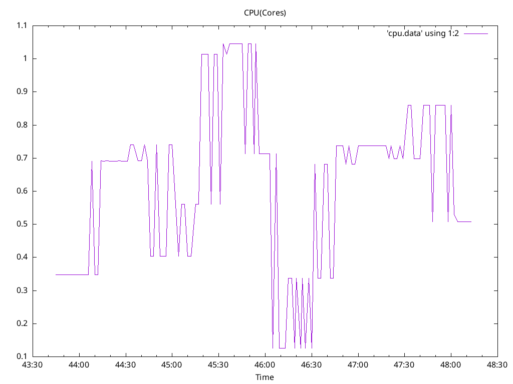
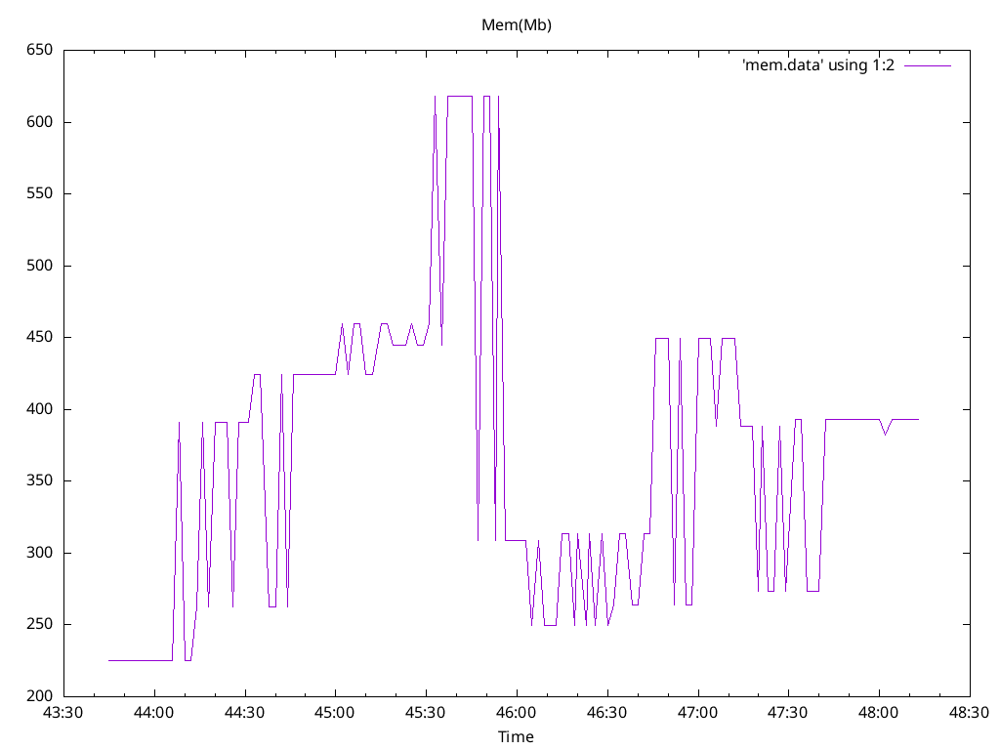

# collector Functionl Benchmark Results
## Options
* Image: quay.io/openshift-logging/vector:5.9
* Total Log Stressors: 1
* Lines Per Second: 5000
* Run Duration: 5m
* Payload Source: synthetic

## Latency of logs collected based on the time the log was generated and ingested

Total Msg| Size | Elapsed (s) | Mean (s)| Min(s) | Max (s)| Median (s)
---------|------|-------------|---------|--------|--------|---
1146379|1024|5m0s|5.134|0.257|14.821|4.623






## Percent logs lost between first and last collected sequence ids
Stream |  Min Seq | Max Seq | Purged | Collected | Percent Collected |
-------| ---------| --------| -------|-----------|--------------|
| loader-0|54252|1458681|0|1146379|81.6%


## Config

```
expire_metrics_secs = 60

data_dir = "/var/lib/vector/testhack-grctj5aw/instance"


[api]
enabled = true

[sources.internal_metrics]
type = "internal_metrics"

# Logs from containers (including openshift containers)
[sources.input_benchmark_container]
type = "kubernetes_logs"
max_read_bytes = 3145728
glob_minimum_cooldown_ms = 15000
auto_partial_merge = true
include_paths_glob_patterns = ["/var/log/pods/testhack-grctj5aw_*/*/*.log"]
pod_annotation_fields.pod_labels = "kubernetes.labels"
pod_annotation_fields.pod_namespace = "kubernetes.namespace_name"
pod_annotation_fields.pod_annotations = "kubernetes.annotations"
pod_annotation_fields.pod_uid = "kubernetes.pod_id"
pod_annotation_fields.pod_node_name = "hostname"
namespace_annotation_fields.namespace_uid = "kubernetes.namespace_id"

[transforms.input_benchmark_container_viaq]
type = "remap"
inputs = ["input_benchmark_container"]
source = '''
  .openshift.cluster_id = "${OPENSHIFT_CLUSTER_ID:-}"
  if !exists(.level) {
    .level = "default"
    if match!(.message, r'Warning|WARN|^W[0-9]+|level=warn|Value:warn|"level":"warn"|<warn>') {
      .level = "warn"
    } else if match!(.message, r'Error|ERROR|^E[0-9]+|level=error|Value:error|"level":"error"|<error>') {
      .level = "error"
    } else if match!(.message, r'Critical|CRITICAL|^C[0-9]+|level=critical|Value:critical|"level":"critical"|<critical>') {
      .level = "critical"
    } else if match!(.message, r'Debug|DEBUG|^D[0-9]+|level=debug|Value:debug|"level":"debug"|<debug>') {
      .level = "debug"
    } else if match!(.message, r'Notice|NOTICE|^N[0-9]+|level=notice|Value:notice|"level":"notice"|<notice>') {
      .level = "notice"
    } else if match!(.message, r'Alert|ALERT|^A[0-9]+|level=alert|Value:alert|"level":"alert"|<alert>') {
      .level = "alert"
    } else if match!(.message, r'Emergency|EMERGENCY|^EM[0-9]+|level=emergency|Value:emergency|"level":"emergency"|<emergency>') {
      .level = "emergency"
    } else if match!(.message, r'(?i)\b(?:info)\b|^I[0-9]+|level=info|Value:info|"level":"info"|<info>') {
      .level = "info"
  	}
  }
  pod_name = string!(.kubernetes.pod_name)
  if starts_with(pod_name, "eventrouter-") {
    parsed, err = parse_json(.message)
    if err != null {
      log("Unable to process EventRouter log: " + err, level: "info")
    } else {
      ., err = merge(.,parsed)
      if err == null && exists(.event) && is_object(.event) {
          if exists(.verb) {
            .event.verb = .verb
            del(.verb)
          }
          .kubernetes.event = del(.event)
          .message = del(.kubernetes.event.message)
          set!(., ["@timestamp"], .kubernetes.event.metadata.creationTimestamp)
          del(.kubernetes.event.metadata.creationTimestamp)
  		. = compact(., nullish: true)
      } else {
        log("Unable to merge EventRouter log message into record: " + err, level: "info")
      }
    }
  }
  del(.source_type)
  del(.stream)
  del(.kubernetes.pod_ips)
  del(.kubernetes.node_labels)
  del(.timestamp_end)
  ts = del(.timestamp); if !exists(."@timestamp") {."@timestamp" = ts}
'''

# Set log_type
[transforms.input_benchmark_viaq_logtype]
type = "remap"
inputs = ["input_benchmark_container_viaq"]
source = '''
  .log_type = "application"
'''

[transforms.output_http_normalize]
type = "remap"
inputs = ["input_benchmark_viaq_logtype"]
source = '''
  del(.file)
'''

[transforms.output_http_dedot]
type = "remap"
inputs = ["output_http_normalize"]
source = '''
  .openshift.sequence = to_unix_timestamp(now(), unit: "nanoseconds")
  if exists(.kubernetes.namespace_labels) {
      for_each(object!(.kubernetes.namespace_labels)) -> |key,value| { 
        newkey = replace(key, r'[\./]', "_") 
        .kubernetes.namespace_labels = set!(.kubernetes.namespace_labels,[newkey],value)
        if newkey != key {
          .kubernetes.namespace_labels = remove!(.kubernetes.namespace_labels,[key],true)
        }
      }
  }
  if exists(.kubernetes.labels) {
      for_each(object!(.kubernetes.labels)) -> |key,value| { 
        newkey = replace(key, r'[\./]', "_") 
        .kubernetes.labels = set!(.kubernetes.labels,[newkey],value)
        if newkey != key {
          .kubernetes.labels = remove!(.kubernetes.labels,[key],true)
        }
      }
  }
'''

[sinks.output_http]
type = "http"
inputs = ["output_http_dedot"]
uri = "http://localhost:8090"
method = "post"

[sinks.output_http.encoding]
codec = "json"

[transforms.add_nodename_to_metric]
type = "remap"
inputs = ["internal_metrics"]
source = '''
.tags.hostname = get_env_var!("VECTOR_SELF_NODE_NAME")
'''


```

